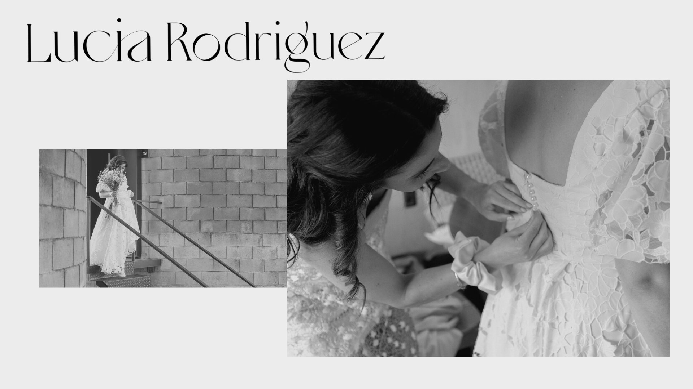

# *Un poco de quien soy*

Mi nombre es *Lucía Rodríguez* soy mamá de Piero y Simón, Diseñadora textil y docente de Diseño en la Escuela técnica de Minas.

Me pueden encontrar en instagram como https://www.instagram.com/luciarodriguez.altacostura/ ahí podran encontrar mi acercamiento a la alta costura y el trabajo a medida de indumentaria especial. 

Por otro lado exploro un universo de caracter más mundano y casual en https://www.instagram.com/estudiocreativo.lunar/  el fin de este espacio es lograr  prendas de uso cotidiano con la colaboración de mujeres de la zona que trabajan en la confección de las piezas. Busco una modalidad de producción en paz, que respete los tiempos de las personas y los procesos creativos, que no se rija por tendencias o temporadas efímeras. 

Mi cable a tierra es el deporte y el contacto con la naturaleza, disfruto de compartirlo con mi familia, me interesan los hábitos saludables y el manejo respetuoso de los recursos naturales. Creo que son raíces que se arraigaron en mi infancia en el campo, hoy las considero un regalo.

Me entusiasma esta nueva formación, confío en forjar herramienta que pueda compartir en los espacios que habito, que será un intercambio muy valioso que me sitúa nueva mente en el arte de aprender. 

Los saludo y los invito a acompañarme en este viaje...
