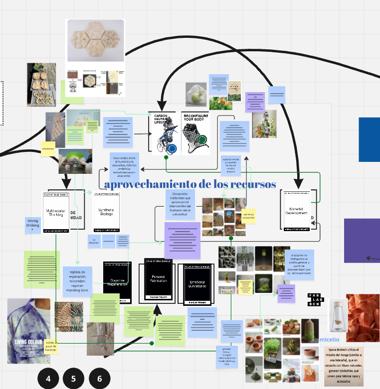
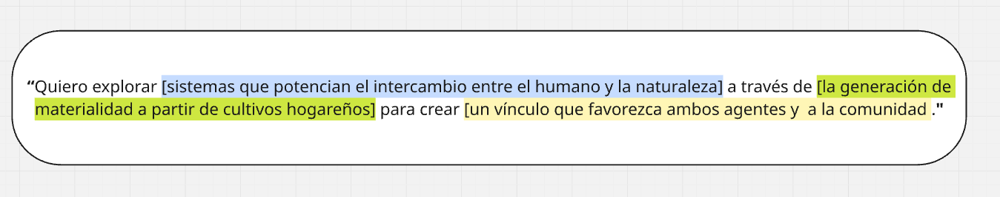
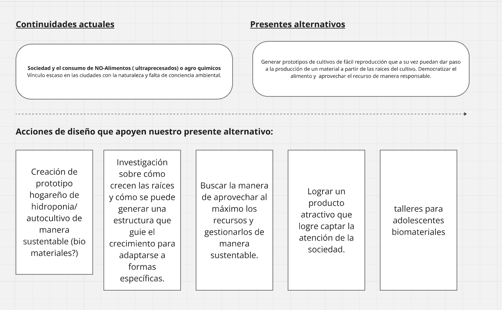
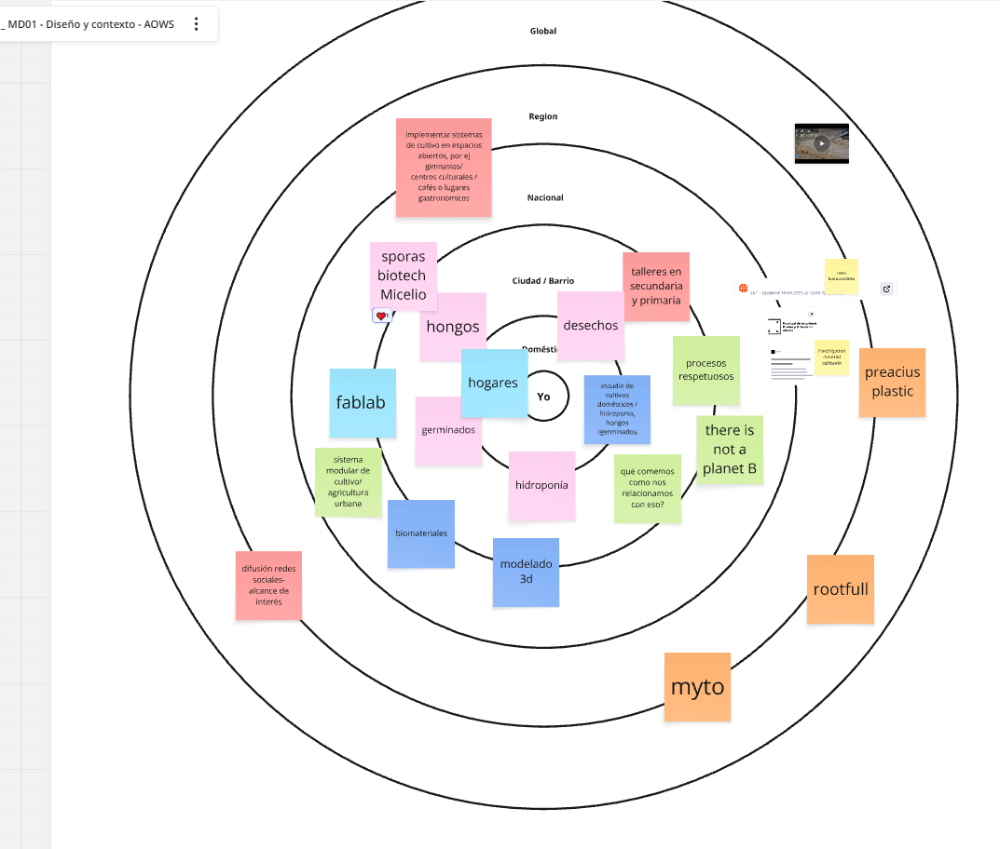

---
hide:
    - toc
---
# MD01 Proyecto y Diseño

Este módulo nos abre la puerta a un "laboratorio de ideas" generando dinámicas de innovación que nutren nuestras zonas de interés y nos hacen integrar nuestro entorno como punto de inflección para el desarrollo creativo y la construcción de ideas. 

Comenzamos con las exploración de *Weak Signals*. 

Aleatoreamente las tarjetas funcionan como disparadores de palabras conceptos que luego empiezan a vincularse, resultando en la expresión de Ideas o sectores de Interés. 
### Board

Luego dimos paso a generar intenciones que provienen de este procesos, además pudimos generar intercambio de información con el resto de compañeros, ya sean links de interés a las temáticas y contactos locales y/o regionales para dar paso a la investigación en cada sector de interés. 
### Discurso 

Intentamos seguir progresando en el discurso detectando **Continuidades actuales** (problemas) y **Presentes alternativos** (pequeñas acciones en las que se puede comenzar a trabajar para generar soluciones)

### Mapa multiescalar 
Análizamos nuestro moodboard a travéz de un **Mapa multiescalar**, intentando situar nuestras ideas en diferentes entornos,  me pareció muy interesante poder detectar acciones que puedo implementar a corto plazo y porder proyectar las ideas dentro de cada nivel. Analizar posibles escenariosdando sentido a algo que parece pequeño y podría desarrollarse a diferentes escalas.

En esta semana logramos acercarnos a nuestras  zonas de interés, en lo personal disparó varios enfoques posibles y me sentí cercana a mi zona de confort y a la vez aventurandome en espacios que nunca exploré. Encuentro varias vías posible de trabajo pero soy consciente de que me hace falta descubrir y acercarme a conocimientos técnicos y teóricos que aporten a mis ideas. 

### Ideas de proyecto 

Imagino posibles prototipos de facil implementación para cultivar Hongos y/o alimentos en los hogares. Esto me bridaría un proyecto en el que puedo vicular a la comunidad, pero siento que la innovación en si está en lo vincular y no en el diseño del producto.

Por otro lado podría trabajar directamente con la reproducción de micelio para generar materiales alternativos al cuero de manera sustentable. ¿cómo podría integrar en la inclusión de la comunidad y el concepto de democratizar el alimento? 

*Gracias por llegar hasta acá*   :)