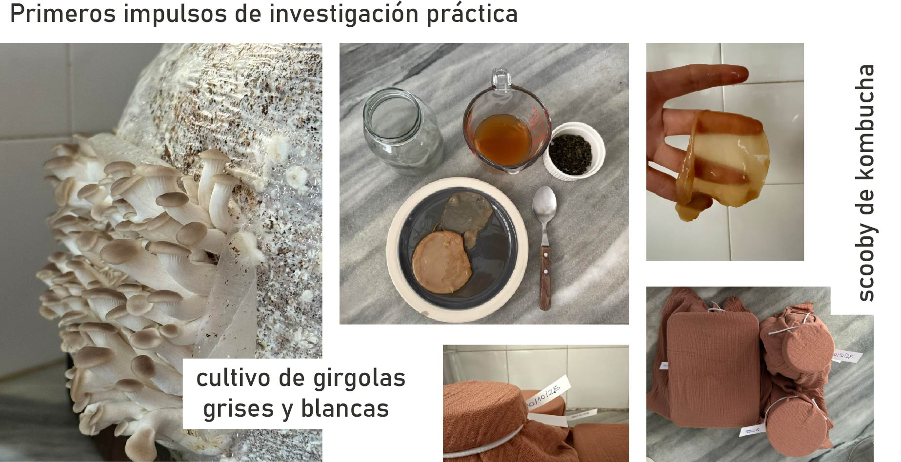

---
hide:
    - toc
---
# MD02- Proyecto y Diseño
*Encabezando las ideas*

En esta etapa intentamos usar palabras más concretas para la definición y desarrollo del cada proyecto, los módulos de diseño nos invitan a pensar a partir de diferentes perspectivas, evaluando proyectos afines a nuestros intereses y otros no tan afines pero con perspectivas de innovacion con los que podemos acercarnos a nuevos enfoques. 

Para estos ejercicios trabajamos en la plataforma de Miro, las plantillas nos dirigen en un camino de pensamiento en el que exploramos posibles prototipos herramientas, resultados y/o productos. 

El primer ejercicio nos derivó a pensar en que problemas estamos abarcando en este proyecto. Es parte de medir que tan necesario es este proyecto como puesdo influir y a quienes estoy ayudando. 
Da comienzo a ponerle piez y cabeza a  la investigación. 

En este punto encuentro me di cuenta que el problema que estoy abordando es más social de lo que pensaba. Y comienzo a encontrar sentido en mi discurso. 

Luego capturamos referentes, analizamos que impacto han tenido y resultados, que podriamos tomar o mejorar en cada caso. 
Se vuelve muy interesante el compartir y abrir el juego con compañeros que pueden aportar de cada una de sus áreas de interés y conocimiento, se vuelve muy productivo y divertido el intercambio. 

Luego pasamos a una jam session, en la que definimos acciones desde hoy a 3meses y ponderamos en dificultad y reelevancia cada una de ellas.  

Este paso hace las veces de filtro para ver cuales acciones pueden ser encaradas primero, cuales llevarán más esfuerzo, como puedo empezar a vincularme con agentes que colaboren en estas acciones.
Me pareció una herramienta muy útil y sencilla para cualquier proyecto. 

Luego le damos un marco mas concreto a las etapas anteriores, definiendo acciones, métodos de reelevamiento, tecnologías a aplicar.
Podemos armar un listado concreto que nos ayuda a tomar acción. 

Estos ejercicios me sirven de disparador para poner foco en acciones puntuales, por ejemplo, logré definir mejor mi propósito y convencerme de cual es el camino que voy a tomar. 

Pude definir a que tipo de formación puedo acceder hoy  (teniendo en cuenta los recursos y el tiempo disponible) para cultivo de hongos y contactos con agentes de la region que trabajan en mi línea de interés. Por ejemplo:

Lautaro Moreno, dicta cursos y está experimentando con micoblocks (ciudad de la costa)

Diego Rodriguez (montevideo) amigo, cultiva hongos para consumo propio con los que remplaza el consumo de proteina animal.

FungiFarm (ciudad de la costa) cultivan y promueven el auto cultivo de hongos comestibles. Venden bloques inoculados para fructificar.

Busco la manera de generar una cámara de ambiente controlado para poder trabajar con pruebas y diferentes especies de micelio.
Estoy explorando el fermentador de Domingoclub, que es una pieza de código abierto, creo que es un paso importante y podría convertirse en realidad, ya que involucra fabricación digital y programación herramienta que vamos adquiriendo en la especialización. 

El fermentador permite controlar en el tiempo la temperatura para darle condiciones óptimas de crecimiento al micelio, por lo que he logrado investigar ellos lo están usando a nivel alimenticio y han hecho pruebas de micoblocks. 

Estoy en el proceso de investigar el ensamble y ver si puedo conseguir todas las piezas a nivel local, en caso de que no veremos como reemplazarlas. 

https://domingoclub.com/products/domingo-fermenter-lab

En esta investigación me he enfrentado a la realidad de que la mayor parte de la información se encuentra en inglés (incluso la informacion creada por hispanohablantes), si bien podemos hacer la traducción no deja de ser un paso más, un esfuerzo extra.
Por lo que espero poder tener como resultado de esta investigación una biblioteca de procesos clara y en español para poder difundir y compartir el conocimiento. 

