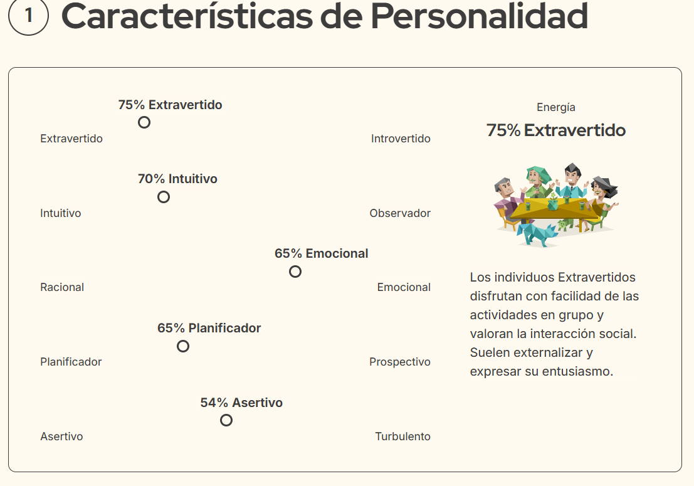

# Actitud emprendedora:

Primero, reflexionamos..

 - ¿Qué motivos nos llevan a esta formación? 

 En el marco de la formación de la especialización en fabricación digital e innovación se plantea este recurso, el ser creadores de un producto desde el perfil del diseñador te convierte automaticamente en un ser que necesita "vender" o promover su creación. 
 Las herramientas para convertir tu desarrollo en un emprendimiento pueden ser fundamentales para darle un sostén económico y perdurable a través del tiempo. 

 - ¿Qué esperas conseguir al finalizar?
 Espero que esta formación me aporte herramientas para organizar mi trabajo, lograr estrategias de difusión y alcance, definir objetivos a mis emprendimientos actuales y esclarecer posibilidades de acción para enrriquecerlos con estas nuevas capacidades. 

### Módulo 1 - Autoconocimiento emprendedor.

Test de personalidad/ resultado: 

Claves para desarrollar una Mentalidad Emprendedora

 - Organizar el trabajo por metas y objetivos. 
 - Busca libertad e independencia, sal de tu zona de confort. 
 - Rentabilizar tus pasiones. 
 - Busca clientes.
 -