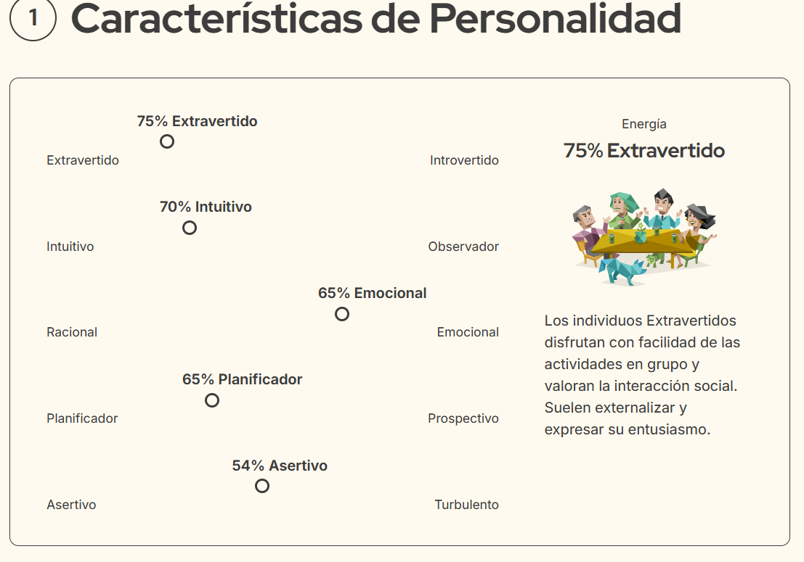
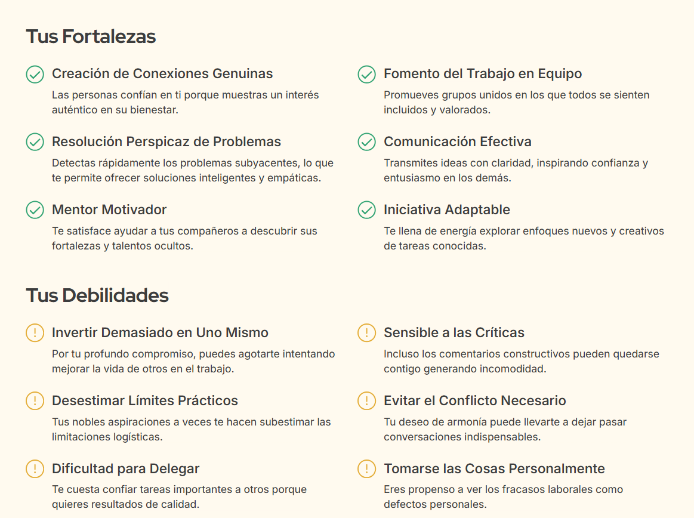
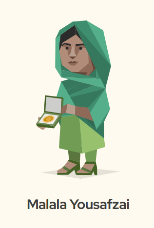
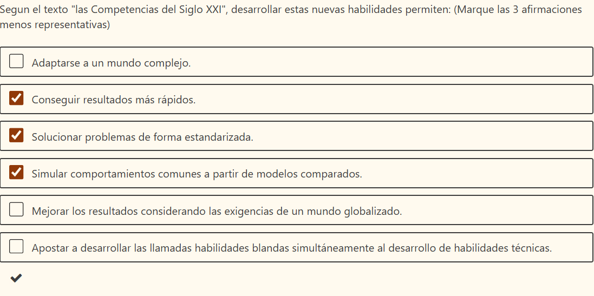
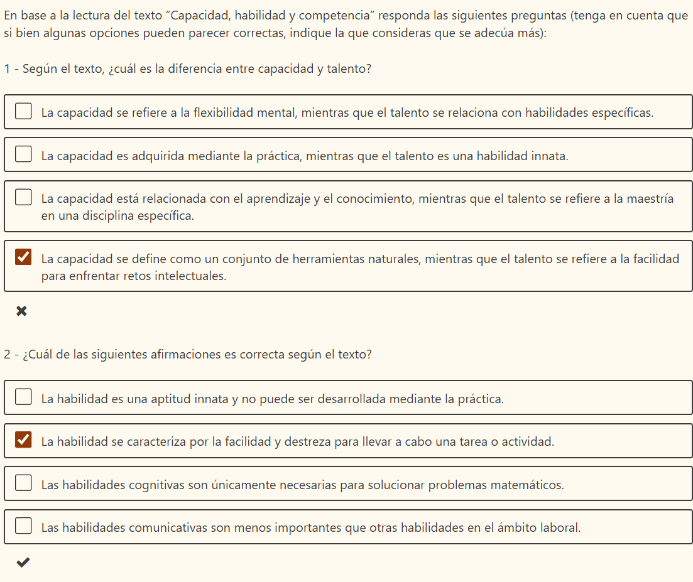
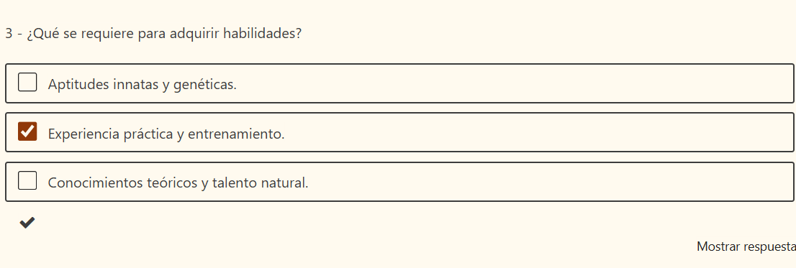
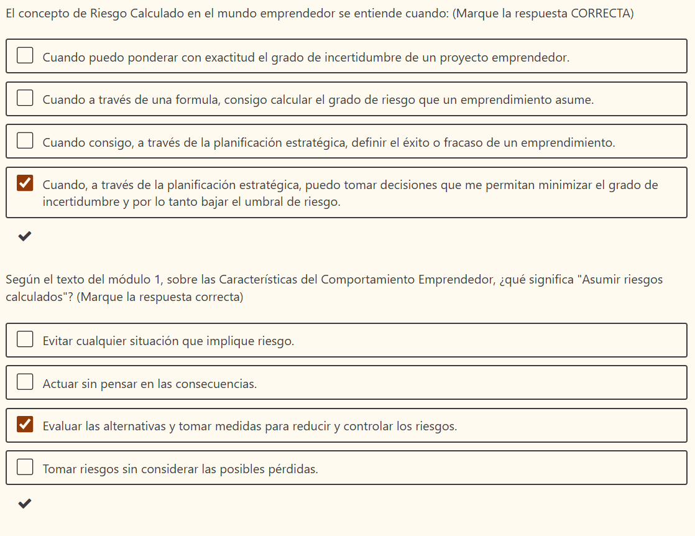
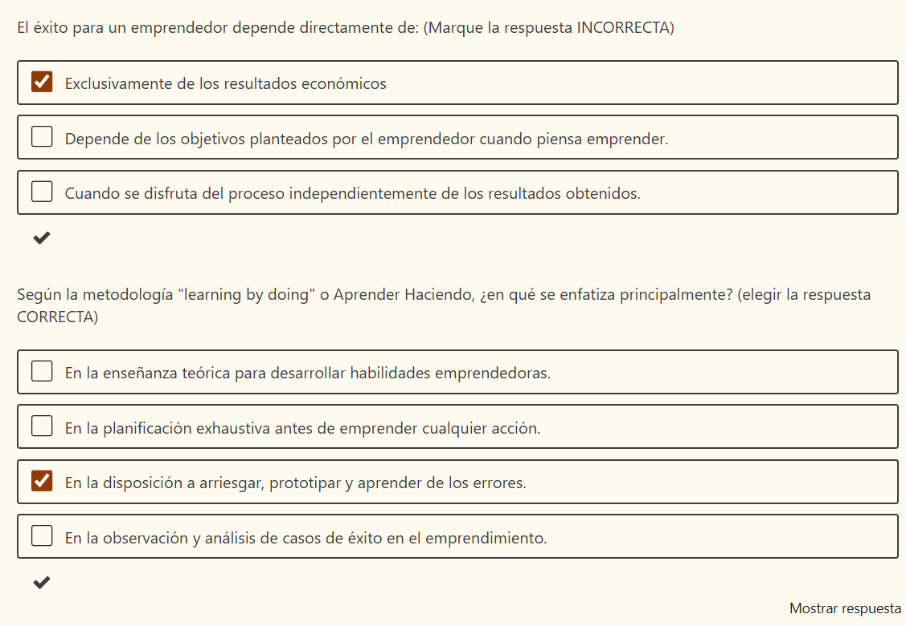

# Actitud emprendedora:

Primero, reflexionamos..

 - ¿Qué motivos nos llevan a esta formación? 

 En el marco de la formación de la especialización en fabricación digital e innovación se plantea este recurso, el ser creadores de un producto desde el perfil del diseñador te convierte automaticamente en un ser que necesita "vender" o promover su creación. 
 Las herramientas para convertir tu desarrollo en un emprendimiento pueden ser fundamentales para darle un sostén económico y perdurable a través del tiempo. 

 - ¿Qué esperas conseguir al finalizar?
 Espero que esta formación me aporte herramientas para organizar mi trabajo, lograr estrategias de difusión y alcance, definir objetivos a mis emprendimientos actuales y esclarecer posibilidades de acción para enrriquecerlos con estas nuevas capacidades. 

### Módulo 1 - Autoconocimiento emprendedor.

Test de personalidad/ resultado: 

### Módulo 2 - Las competencias del Siglo XXI
Evaluación 

### Módulo 3- La cuestión del riesgo, del éxito y la tolerancia al fracaso. 

# Generación de ideas de Negocio:

Describe tu idea de negocio en un texto de hasta 500 caracteres. 

Puede ser alguna idea de emprendimiento que hayas venido pensando o ya estés trabajando, como así también alguna idea que haya surgido en el curso.
Venta de productos de cuero/textiles generados a partir de Biomateriales a partir del Micelio de hongo Reishi.
MERCADO
1 | ¿Qué problema o necesidad importante tienen mis potenciales clientes, que mi emprendimiento busca resolver?
Dropdown
Pensá en tus usuarios o clientes: ¿Qué situación molesta, frustrante, costosa o ineficiente enfrentan? ¿Qué están tratando de resolver en su vida o trabajo que tu propuesta
puede mejorar?
Propongo el desarrollo de un material que pueda sustituir el mal llamado " cuero ecológico" (debido que está compuesto por plásticos y significa un problema en la industria textil,  
es de mala calidad y altamente contaminante, intenta sustituir el cuero animal pero es igualmente perjudicial). 
A nivel mundial esta investigación está tomando mayor importancia en materiales solidos (para  construcción, decoración )  pero también hay resultados en cuero  y alimentos.  
El Micelio funciona como un aglutinante que crece rápidamente y puede unificar fibras u otros materiales si uno le brinda las condiciones que necesita, luego  dependiendo de las 
formas en la que uno seque ese hongo adquiere diferentes cualidades.
2 | ¿A quién le voy a vender? ¿Quién es realmente mi cliente?  ¿Quién es mi usuario?
Describí a las personas o empresas que tienen el problema y usarían tu solución. ¿Qué edad tienen? ¿Dónde viven? ¿Qué hacen? ¿Qué buscan? ¿Cómo se comportan?
En primer lugar personas que busquen productos a base de un material respetuoso con el medio ambiente y con los trabajadores que lo fabriquen.  
Es una población que inminentemente está en crecimiento debido al impacto que las producciones masivas están teniendo en el mundo. 
La estética y funcionalidad del producto deberá estar pensada para cierta población que aún no defino.
Tal vez dicho producto pueda ser simplemente el material, en ese caso mis clientes serían empresas comprometidas con las causas anteriormente expresadas.
Se encuentran en todo el país, pequeños y grandes emprendedores que trabajen en cuero. 
3 | ¿Qué otras soluciones existen actualmente (competencia)?
Mencioná qué productos o servicios similares hay. ¿Cómo resuelven hoy este problema tus clientes? ¿Están conformes con eso?
En Uruguay no he encontrado investigaciones similares, pero si en otros países ya es un producto que se comercializa:
https://boltthreads.com/technology/mylo/
https://mogu.bio/mycelium-acoustic-panels/
4 | ¿Cómo se espera que evolucione este mercado?
Comentá si el mercado está creciendo, cambiando o si hay nuevas oportunidades a futuro.
Pienso que los recursos renovables y de bajo impacto ambiental están en una etapa de crecimiento exponencial.  
RECURSOS
5 | ¿Qué recursos necesito para poner en marcha esta idea?
Enumerá recursos clave: maquinaria, personas, insumos, conocimientos, tecnología, etc.
En principio tiempo de investigación,  colaboración de micólogos y/o expertos en el área del crecimiento de micelio. (ya tengo algunos contactos con personas afines).
Laboratorio y/o espacio de trabajo estable. 
Incubadora aislada para micelio, controlador térmico y de humedad. 
Herramientas de fabricación digital. 
Plancha industrial con prensa. o Horno de secado con prensas que soporten el calor. 
Micelio y diferentes sustratos para realizar pruebas.
Corte láser, placa 3d para generar texturas textiles. 
6 | ¿Qué puedo aportar personalmente al emprendimiento?
Mencioná recursos que ya tenés: habilidades, conocimientos, contactos, equipamiento, capital, etc.
Conocimientos de Diseño y perspectiva creativa.
Conocimiento de como trasformar del plano al volumen. Modelado.
Inventiva. Investigación y entusiasmo. 
Maquinaria e insumos de confección para el prototipado de productos. 
Modistas capacitadas para la confección a nivel local. 
7 | ¿A quién podría sumar a mi red de contactos?
Pensá en personas, instituciones, mentores o entidades que podrían ayudarte o colaborar.
Un Micólogo para la etapa inicial de desarrollo. 
Alguien que me ayude a organizar y planificar las tareas. 
EQUIPO
8 | ¿Quienes componen el equipo emprendedor?
Este punto no está consolidado.

9 | ¿Qué conocimientos y experiencia tiene el equipo que es relevante para el desarrollo del emprendimiento?
Lucía (Diseñadora)-   Directora del proyecto, desarrollo de producto, investigación.
Gonzalo (ingeniero civil) , Logístico y técnico,  instalaciones en el espacio de trabajo desarrollo  de la incubadora y estructuras para la "fábrica". 
Utec- innovación, equipo de fabricación digital, (formación)
Confección de productos: se terceriza con modistas locales. (Blanca y Cristina)
10 | ¿Qué roles están cubiertos y qué roles estarían faltando?
Tengo:
Director y desarrollo de producto. 
Departamento técnico. 
Faltan: 
Un perfil de organización y presupuestos. 
Alguien que pueda hacer un seguimiento de la producción. (Empleados, en principio lo haríamos nosotros)
Equipo de ventas. (una vez que se consolide el producto)

Este formulario se creó en UTEC

### Reflexiones sobre el módulo

Este módulo nos da la oportunidad de ver el potencial de ideas de negocio que podrían surgir a partir de este proceso de exploración, si bien es un buen ejercicio, no todos los proyectos son un negocio o están listos para esta etapa. 

-