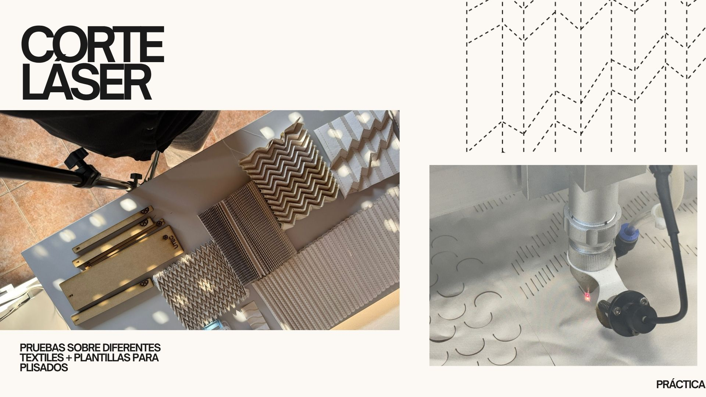

hide: 
- toc
# ✂️ Corte láser

- **Created:** Junio 2026
- **Tags:** Experimentación, Materiales, Corte láser, diseño textil

## Descripción

Esta ficha describe las pruebas de corte láser realizadas en la fase de experimentación. El corte láser es una técnica versátil que permite trabajar con diversos materiales y obtener resultados precisos.

## El archivo

Para realizar un corte láser necesitamos trabajar con archivos vectoriales 2D, usamos softwares como Illustrator o Inkscape para generar estos archivos. 

Nuestro dibujo vectorial funciona como un archivo CAD que contiene los datos de nuestro diseño. Para poder trabajar con una cortadora láser, debemos usar un software que transforme esa información en una trayectoria (software CAD), indicándole a la máquina cómo desplazarse dentro de los ejes XY para trazar nuestro dibujo de la manera más eficiente.

Por lo general, cada cortadora láser tendrá su propio software. En el Lab de Minas usamos RDworks.

En este programa podemos setear distintos parámetros dependiendo de los materiales que deseemos cortar y la potencia de la máquina. (esto lo veremos en cada situación)

Paso a paso básico para el uso de una cortadora láser.

<!DOCTYPE html>
<html lang="es">
<head>
<meta charset="UTF-8">
<meta name="viewport" content="width=device-width, initial-scale=1.0">
<title>Flujo de trabajo — Cortadora láser</title>

</head>
<body>

<h1>Flujo de trabajo — Cortadora láser</h1>

Paso a paso desde el encendido hasta el corte

Preparación

  
1

  

    
🔌 Encendido y ventilación

    
Encender la máquina y verificar que el extractor de aire esté funcionando.

  

  
2

  

    
💾 Cargar archivo desde USB

    
Copiar el archivo desde la memoria USB a la máquina usando la interfaz:

    

      File → (mover a la derecha hasta el final de la fila) 
      Undisk+ → Enter → Read U file → Enter 
      Copy to mem → Enter → Escape  
      Luego: File → (buscar el archivo recién copiado) → Enter
    

  

Configuración

  
3

  

    
🖥️ Verificar parámetros

    
El display muestra una vista previa del archivo con velocidad, potencia y capas de corte vs. grabado identificadas por color.

  

  
4

  

    
🎯 Definir origen

    
Usar las flechas <strong>X/Y</strong> para posicionar el puntero láser en el origen deseado. Confirmar con el botón <strong>Origin</strong>.

  

  
5

  

    
📏 Cargar material y ajustar foco

    
Verificar la distancia entre el puntero láser y el material. Lo estándar es <strong>7 mm</strong>, pero puede variar según el material y la máquina.

  

Verificación final

  
6

  

    
⬜ Frame — recorrido en seco

    
Presionar <strong>Frame</strong>: la boquilla recorre el área de trabajo sin cortar. Verificar que el material esté bien ubicado antes de continuar.

  

  
7

  

    
▶️ ¡Iniciar corte!

    
Presionar <strong>Start</strong> para comenzar el trabajo.

  

  
⚠️ Seguridad — siempre presentes

  

Trabajar siempre con la cámara cerrada y protección ocular.

  

No dejar la máquina sola — estar cerca ante cualquier falla.

  

Válvula de seguridad a mano: presionarla detiene el trabajo de inmediato.

  

Si hay chispas o llama, <strong>nunca usar agua</strong> — usar algo que quite el oxígeno.

</body>
</html>

### Ficha 1

## Plantillas para plisado

📄[[Plantillas disponibles](https://drive.google.com/drive/folders/1gPYXmxWb4KO5qtIqeHYtKbnYUo5L9nUC?usp=drive_link)] 

