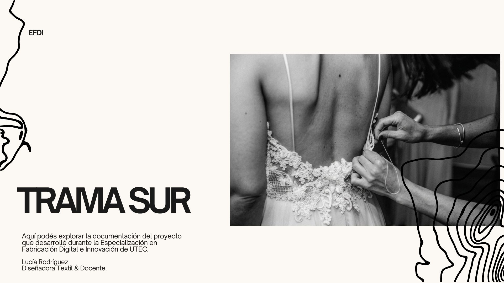
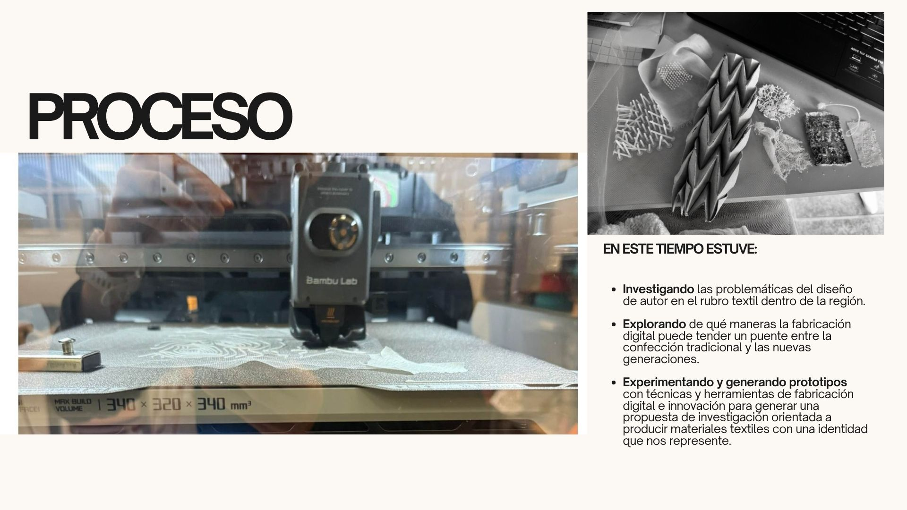
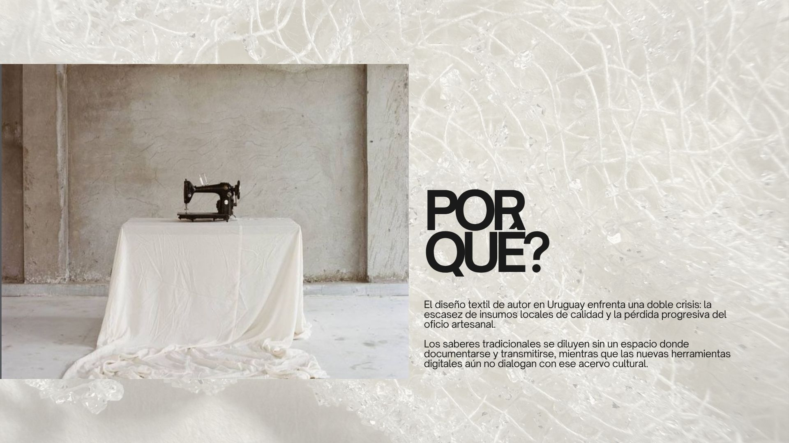
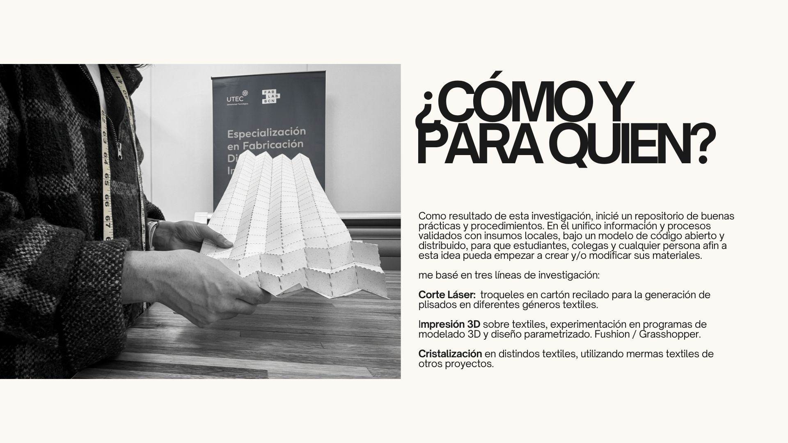
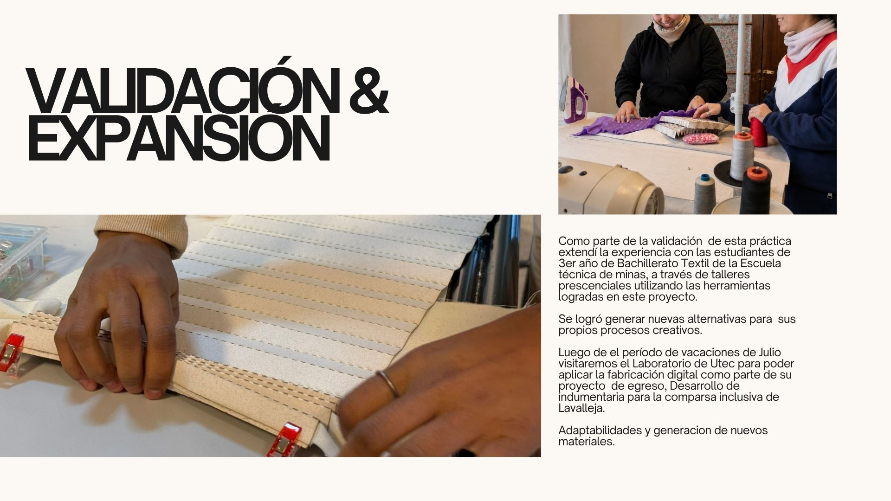
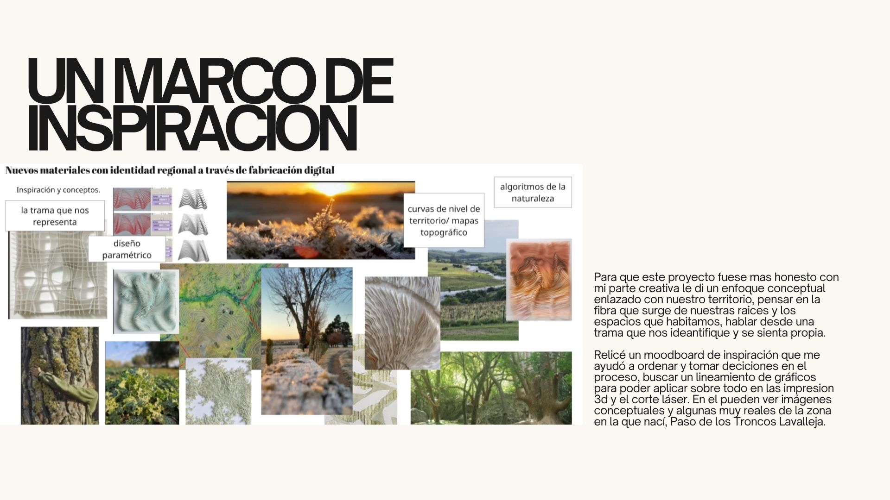
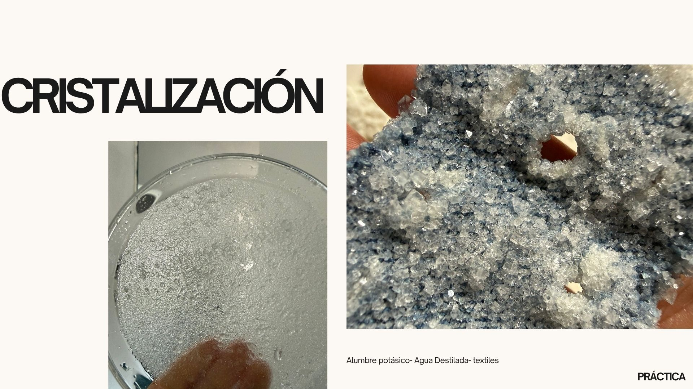
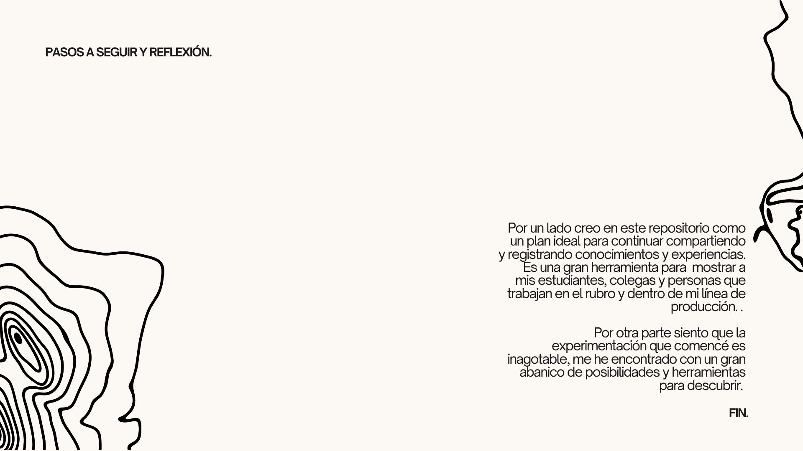

### Problema y contexto

### Alcance y propuesta

### Experimentación

#### Cristalización
Ver +

[Ver ficha completa](fichas/exp-cristalizacion.md)

#### Impresión 3D sobre textiles
➡️
[Ver ficha completa](fichas/exp-impresion-3d.md)

➡️ [Ver ficha completa](fichas/exp-corte-laser.md)

### Video

[Ver video en YouTube](https://youtu.be/ieU1R_zO40Y?t=12){:target="_blank"}

