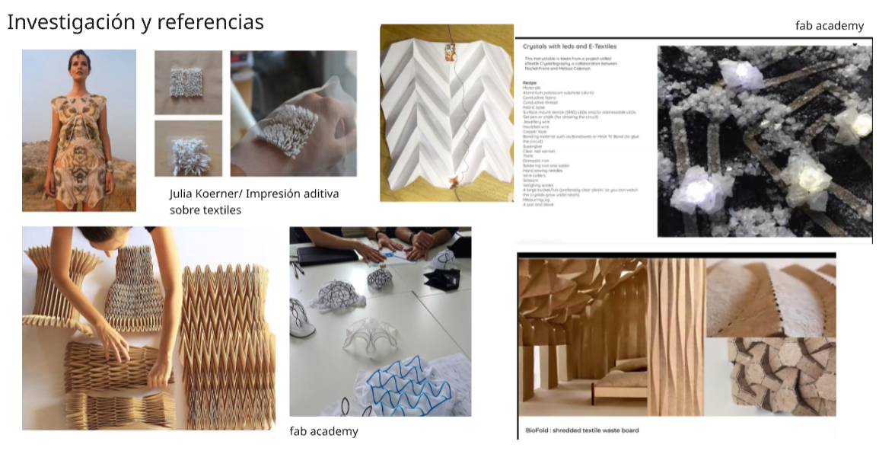

## Tutoriales rápidos

<article class="tutorial-card">
  <a href="proyecto/pre-entrega.md">
    
    <h3>Ideas que disparan este proyecto</h3>
    
Entrada rápida para conocer el contexto y la génesis del proyecto.

  </a>
</article>

<article class="tutorial-card">
  <a href="diseno/md01.md">
    
    <h3>Diseño conceptual</h3>
    
Un vistazo a la idea, el moodboard y el proceso creativo.

  </a>
</article>

<article class="tutorial-card">
  <a href="tecnicos/mt01.md">
    
    <h3>Validación de técnicas</h3>
    
Mini guía sobre pruebas de materiales y procesos técnicos.

  </a>
</article>

###

### Problema y contexto

### Alcance y propuesta

### Experimentación

   

### Repositorio

