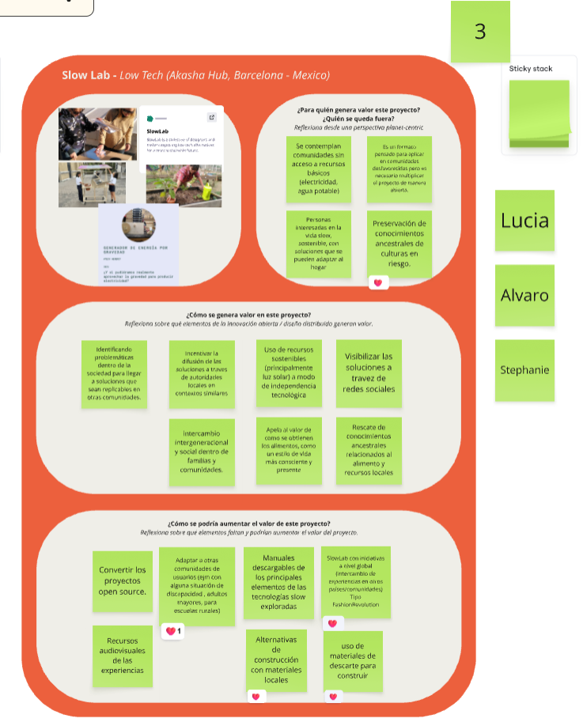
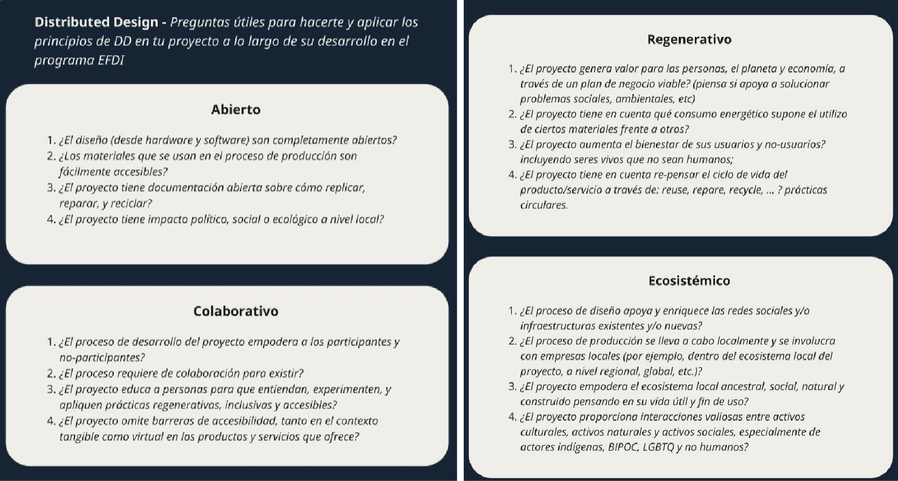
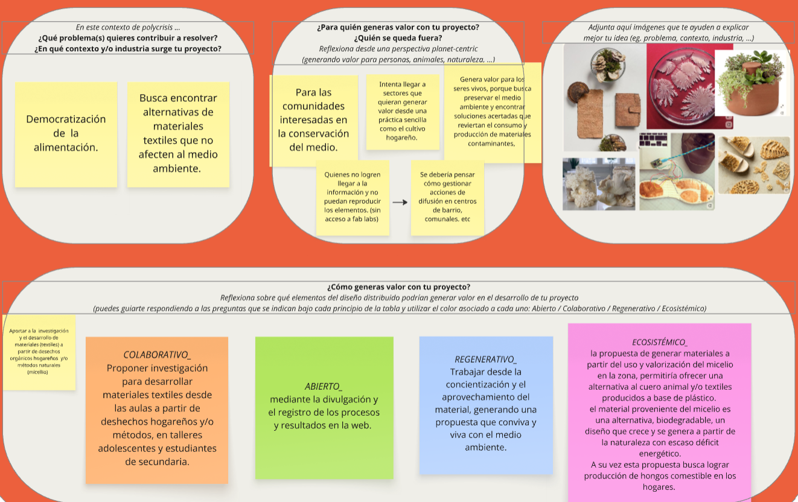

---
hide:
    - toc
---

# MI01

*Innovación abierta y distribuida*

En este módulo descubrimos y analizamos proyectos de código abierto. 
En primera instancia realizamos un análisis de proyectos existentes divididos por equipos, me tocó trabajar con Stephy y Álvaro me sorprendieron con sus ideas y la manera rápida de poder expresarlas, la verdad aprendí mucho de ellos, y el análisis en solo 15 minutos se volvió muy fácil completamos los aspectos pedidos rápidamente cada uno aportó desde su perspectiva, el cuadro quedó de la siguiente manera: 

Tuvimos la siguiente guía, que me parece reelevante tenerla prescente para las siguientes etapas del proceso: 

En ésta instancia trabajamos con el análisis de nuestro proyecto, en lo personal me costó mucho ya que aún no consolido bien mis ideas. 

Tengo algunos datos seguros: 
Me interesa trabajar con la materialidad, dar soluciones textiles que sean amigables y en pro del medio. 
Como "obrera textil" me veo todo el tiempo lidiando con el déficit de buenas materias primas, pagamos precios desmedidos por textiles de polyester importados. 

 Encontré *Los cultivos hogareños*  (micelio o hydroponia) como una propuesta que me interesó 
al tratarse de un tema que conecte con una alimentación saludable y conciente, lo cual me puede brindar un marco de interés social.

  Me interesa trabajar con un entorno al cual creo debemos dar herramientas que son los niños y adolescentes. Mi idea es poder plantar esta semilla de inquietud, difundiendo informacion de valor en hogares y entornos sociales a los que debemos contribuir.  

A su vez creo importante poner foco en el aprovechamiento de recursos y la eficiencia energética.

Aquí comparto el resultado de mi ejerecicio: 

Tuve que forzar un poco mis ideas pero creo que me ayudó a enmarcar mi propuesta, a partir de este trabajo logro poner foco en la experimentación de materiales para estas primeras etapas y luego podré encontrar maneras de llevarlo a la difusion con talleres y otras propuestas. 

