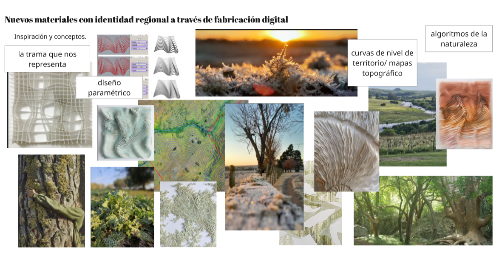

---
hide:
    - toc
---

### Inspiracion

Nuevos materiales con identidad regional a través de fabricación digital 

Paso de los Troncos, Lavalleja Uruguay
Heladas al amanecer por Elizabeth (Productora Rural) 
PH: https://www.instagram.com/elizabethcesaraviaga/

Este proyecto nace de una escucha profunda al territorio uruguayo. Los bosques nativos, los perfiles de rocosos de nuestra sierras, el agua que serpentea entre las cuchillas. 

