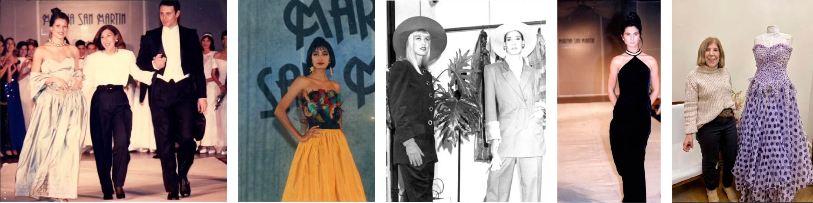

---
hide:
    - toc
---

# Ideas que disparan este proyecto

El bosque nativo como archivo. El paisaje de Lavalleja como lenguaje. El textil como traducción.

Paso de los Troncos, Lavalleja Uruguay
Heladas al amanecer por Elizabeth (Productora Rural) 
PH: https://www.instagram.com/elizabethcesaraviaga/

### El problema

El diseño de autor textil en Uruguay constituye una práctica cultural y productiva de alto valor simbólico y artesanal, pero enfrenta un conjunto de tensiones estructurales que comprometen su viabilidad, su continuidad generacional y su capacidad de innovación.

La ausencia de herramientas técnicas adaptadas a las particularidades del oficio, la dependencia de insumos importados y la progresiva pérdida de saberes tradicionales configuran un escenario de vulnerabilidad que requiere intervención desde la investigación aplicada y la fabricación digital.

### Entrevista a Martha San Martín

.jpeg)

Para darle un contexto a este problema realicé una entrevista a mi querida mentora Martha San Martín. 

Hay personas que no solo hacen ropa, sino que sostienen un oficio. Martha San Martín es una de ellas. Diseñadora de alta costura y referente del diseño de autor en Uruguay, su trayectoria está marcada por la resiliencia, la formación de nuevas generaciones y un compromiso profundo con el oficio textil como patrimonio vivo. A lo largo de los años no solo vistió y emocionó con su trabajo, sino que generó empleo, abrió puertas y hoy sigue aportando desde la enseñanza, formando a quienes serán el futuro del diseño nacional. En esta entrevista conversamos con ella sobre la pérdida del oficio, el lugar de la innovación y la fabricación digital en el territorio, y su mirada sobre el presente y futuro del rubro textil en Uruguay.

### Propuesta del Proyecto. 

Este proyecto se sitúa en el ecosistema del diseño de autor uruguayo, integrado por diseñadores independientes, estudiantes, modistas, bordadores y emprendedores textiles que desarrollan su actividad predominantemente en talleres de pequeña escala.

El proyecto propone un repositorio de investigación y buenas prácticas  que explora la integración de la fabricación digital en el diseño de autor textil uruguayo.

A través del desarrollo de herramientas físicas, protocolos de trabajo y recursos técnicos validados, busca tender un puente entre el saber artesanal del oficio y las posibilidades que ofrecen las tecnologías contemporáneas de producción.

El proyecto aborda la preservación y resignificación de técnicas tradicionales del oficio textil, y la exploración de alternativas de materialidad con  insumos disponibles en el mercado local.

Responde a una necesidad real y urgente de un sector con identidad cultural fuerte pero con herramientas insuficientes. No propone reemplazar el trabajo artesanal sino potenciarlo, generando recursos que el diseñador independiente pueda incorporar a su flujo de trabajo sin abandonar lo que hace único a su oficio.

La innovación no está solo en la tecnología utilizada, sino en la mirada: traducir las lógicas del taller artesanal al lenguaje de la fabricación digital, y viceversa. Genera metodologías que no existen hoy en el contexto local, documentadas y publicadas en formato abierto para que puedan circular, adaptarse y crecer dentro de la comunidad.

¿Para quién es valioso?

Para el diseñador de autor que busca optimizar su proceso sin perder identidad
Para el estudiante de diseño o costura que necesita un puente entre tradición y tecnología.
Para fablabs y espacios maker que quieran vincularse con el sector textil.
Para el ecosistema cultural y productivo uruguayo que necesita fortalecer su cadena de valor local.

### ¿Cómo? ¿De qué se trata el proyecto?

A través de la experimentación con tenconogías de fabricacion digital e innovación realizaremos ensayos con un registro de procedimientos claro. Fichas de procesos y guías accesibles para usuarios que permita la aplicación de estos recursos. 
 
Este sistema integra procesos digitales y artesanales de manera complementaria. Generando superficies textiles experimentales que podrán ser el punto de partida a nuesvos materiales a partir de recursos que encontramos en la región. 

En esta primera etapa cuento con 3 líneas de investigación

CORTE LÁSER: plantillas en corte láser sobre papel/ cartón y MDF para generar plisados interesantes, aplicaremos patrones clásicos y propuestas y aplicaciones de innovación. 
realizaré pruebas con distintos materiales, generaré un protocolo de pasos para mejorar la eficiencia. 
primeras experiencias 

CRISTALIZACIÓN: ensayos de cristales sobre textiles, aplicacion de tutoriales efdi. 

IPRESIÓN 3d SOBRE TEXTILES: pruebas sobre diferentes materiales, generar diseños enfocados en una inspiración con 

