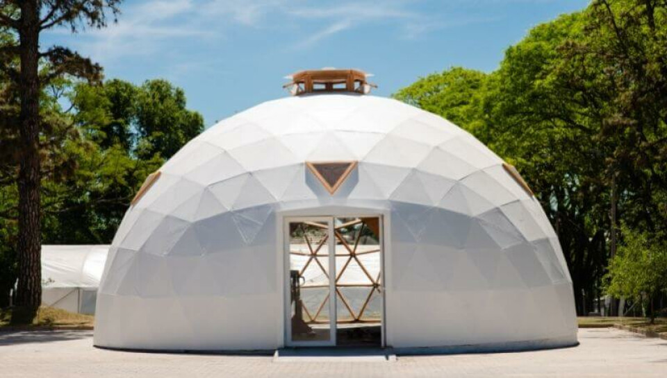
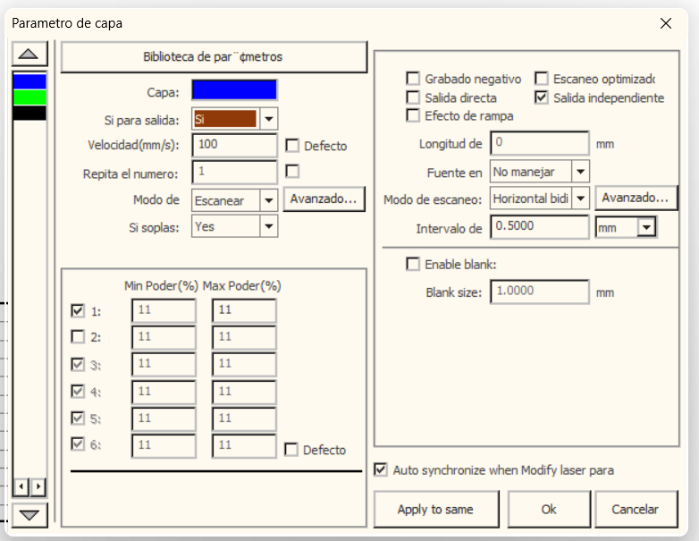
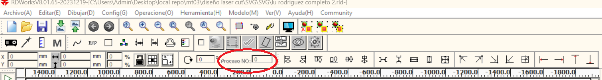

---
hide:
    - toc
---

# Fabricación presencial en el FAB LAB

### Introducción al Fab 

LLega el momento más esperado asíque sin chistar un grupo de estudiantes de la esecialización viajamos a Durazno, nos acompañaron y trabajaron con nosotros Victoria y Joaquín (unos genios, no lo vamos a dejar para el final) y nos recibieron en el fab lab Facundo y Mathías con disposición y buena música para no olvidarnos de que era  viernes. 
Así que allí nos encontramos de frente y esa instancia supo ser de las más ricas y motivadoras:
Irene, Andrea, Lucho y Renato unos compañeros de lujo. 

En primer lugar tuvimos una introducción al espacio de la mano de Facundo, nos explicó varios proyectos en los que trabajan y como lo manejan desde el Fab lab. 
También pudimos visitar el espacio de reciclaje de plásticos, una pequeña isla de preacius plastic en Durazno, conocimos los procesos y máquinas que han logrado desarrollar.

### Instalamos RDWorks

Cuando regresamos al domo comenzamos por chequear la instalación de RDworks V8 (softwear CAM, que convierte los vectores en trayectorias para la contadora láser), en mi caso tuve que re instalar una versión nueva.

Exportamos el archivo desde illustrator en DXF para poder trabajar en el softwear CAM, importamos nuestro archivo y comenzamos a chequear algunas cosas importantes: 

- identificar las capas.
- verificar que el archivo no contenga líneas duplicadas. 
- asignar el color indicado a cada acción/capa (corte, grabado,raster)
- en cada capa asignamos:
            -Velocidad en mm/s (mayor velocidad menordesgaste genera el láser)
            - %power máx y min 
            - marcamos salida independiente.(así nos aseguramos que trabaja cada pieza como independiente y no todo el grabado del archivo como si fuese uno)
            -También establecemos el área de trabajo (900mm x 600mm)
            -Referenciamos el inicio (punto 0), a la derecha y arriba. De esta manera nos aseguramos que este punto será el que le indiquemos a la máquina al iniciar el trabajo.  

Utilizamos la herramienta de simulador para ver y analizar en qué orden se realizará el corte, el tiempo que demorará, este paso es fundamental para detectar errores, podés ver si pasa dos veces por el mismo sitio, o si algún proceso lleva demasiado tiempo. 

Debemos prestar atención a que los grabados o cortes que van en el interior de las piezas cortadas se dejen para el final para evitar que las piezas se muevan y el diseño se vea afectado. 

En mi caso me pasó lo contrario, habíamos asignado un orden de capas específico y el programa no le hizo caso, luego de analizar las opciones varias veces, Victoria encontró la funcion de asignarle el número de proceso a cada parte del proceso, no fue necesario porque las piezas no se movieron pero podría haber sido la solución en caso de que este detalle hubiese sido un problema en el corte.

Guardamos el archivo con extención .rld para ser editable y .rd para copiarlo a la máquina por medio de una memoria USB.

### El corte

Trabajamos con la cortadora SKL-6090.
Al momento de prenderla lo primero que se hizo fue ponderar la distancia de la punta del laser al material con una regleta que ya está calibrada para esa máquina, con el display de la máquina podemos corregir la posición de la "cama" (superficie horizontal donde apoyamos el material) en caso de que no fuese la correcta. 
Los chicos nos explicaron el funcionamiento y comenzamos a cargar archivos de prueba para comenzar a trabajar. 
Se setea el punto 0, se carga el archivo (se copia a la máquina), se ingresa al mismo y luego (teniendo la precaucion de cerrar la tapa) se comienza con el corte.

Con la variedad de archivos que trabajamos, pudimos ver distintos encastres, kerfings perfectos como los de lucho, algunos que fallaron (no eran flexibles o se quebraron porque los cortes eran demasiado juntos). 

En el caso de mi corte me sorprendió que cuando le quité definición a la imagen que pensaba rasterizar tenía un efecto que mejoraba el resultado y además reducía el tiempo de trabajo. Al poder ver la simulación del programa te ayuda a tomar esas deciciones que en una producción grande harían grandes diferencias. 

Todos logramos vivir la experiencia de corte láser, creo que nos hubiesemos quedado algún rato más ;) 
 
### Fotos

Les dejo unas fotos de mi proceso y resultado. 

<video controls src="video fp1.mp4" title="
"></video>

### *Conclusiones*

Como conclusión me queda que en el práctico podemos ver más allá, comprendí de mejor manera los procesos que había pasado desde el armado de Fushion el pasaje al 2d y luego al softwear Cam, esa experimentación presente y matérica por más herramientas virtuales que tengamos no deja de ser fundamental en el aprendizaje. 

También me queda la importancia y lo fundamental que es la prueba y el ensayo para lograr avances y resultados adecuados. 
Que detrás de estas herramientas que son fantásticas no deja de haber un trabajo artesanal y minusioso que es clave.

Lo último es que me encantó conocernos en persona y compartir los mil intereses y la diversidad de enfoques que podemos encontrar. 

Gracias

                          

