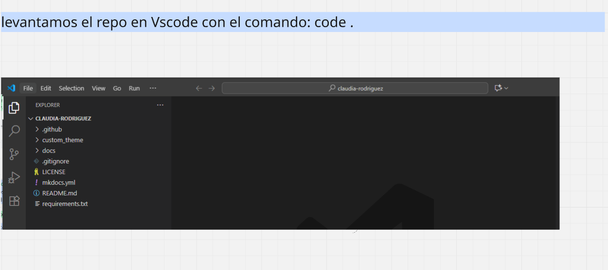

---
hide:
    - toc
---

# MT01, Hola git push!

Se trata de nuestro primer acercamiento a la creación de una página Web la cual usaremos durante el curso como Bitácora registrando el proceso de nuestro proyecto.
A si que bienvenido/a este gran reto de intentar usar terminales, comandos y unos cuantos términos nuevos que poco a poco se van haciendo amigos. 

En primer lugar conocimos fundamentos básicos de como funcionan los servidores y como conectan entre sí la información. La importancia de utilizar un programa que gruarde las versiones de tu trabajo y cómo podrías trabajar con cocreadores  en simultáneo. Lenguaje Mkadoks y httml.

El primer paso fue crear una cuenta Hithub, Instalar Git y Paython. 

Estas instancias fueron guiadas con un tutorial muy claro y el apoyo de Mathias en clase. 

El primer desafío fue dentro de Github, como cualquier app podes editar tu usuario, linquearlo con tu mail y subir tu foto de perfil. Hasta acá bien.

Luego creamos un Ssh Key, este paso es importante para poder trabajar de manera segura.

# Clonar el repositorio

# Descargar tu repositorio 

#Problemas
La verdad no podía ser de otra manera, ya venía muy bien aplicando las soluciones que habían usado en clase los compañeros, pero en un momento Mkdocs no quiso nada conmigo, agradecimientos especiales al profe.

# Ahora si commit push 

Editamos About me y agregamos una foto de nosotros (pilas con eso) 
Dentro del Template tenemos los espacios para poder cambiar el texto y las imágenes. 
Copiando y pegando los diferentes comandos se vuelve sencillo, debes estar atento a las extenciones de las imágenes y a las rutas de cada página que puedes encontrar en mkdocs.

Para cargar las modificaciones debemos dar stage a los cambios, en los files de texto debes cerrarlos y dar save para que se vean en Changes.

Una vez tengas tu paquete commit, debes asignar un comentario y  dar commit.
Luego commit y sicronizar

Así podrás ver  las modificaciones en Github y una vez corran los cambios estarán publicados en tu página. 

