---
hide:
    - toc
---

# MT02

En esta etapa comenzamos por descubrir las herramientas de fabricación digital. 

Damos nuestros primeros pasos en programas de modelado 3D como Fusion 360 y Rhino.

El principio fue descargar los programas y gestionar las licencias de prueba o en el caso de Fusion la licencia para estudiantes. 
en primera instancia al no saber por d+onde espezar,  realicé unas pruebas siguiendo un tutorial. 

Desde el comienzo mi idea era lograr un sistema de cultivo para hongos que fuese simple y fácil para tener en el hogar. 

Enlisté los requisitos luego de una investigación algo rápida: 

- El tamaño debe ser adecuado para colocar encima de una mesada de cocina o pequeña estantería. 
- Debe poder contener el sustrato (porlo cual puede ser similar a una maceta)
-Debe tener orificios por los cuales fructificarán los hongos que se cultiven. 

Opcionales: 

-se podría diseñar una cúpula que mantenga más estables las condiciones de humedad y temperatura. 
-se podría realizar de manera modular para que fuesen encastrables y así poder cultivar distintas variedades. 
-se podría generar un sistema que permita abastecer la humedad y temperatura necesarias dependiendo del clima y/o la estación del año. 

Realicé un moodboard rápido para generar la atmósfera y tener las referencias presentes. 

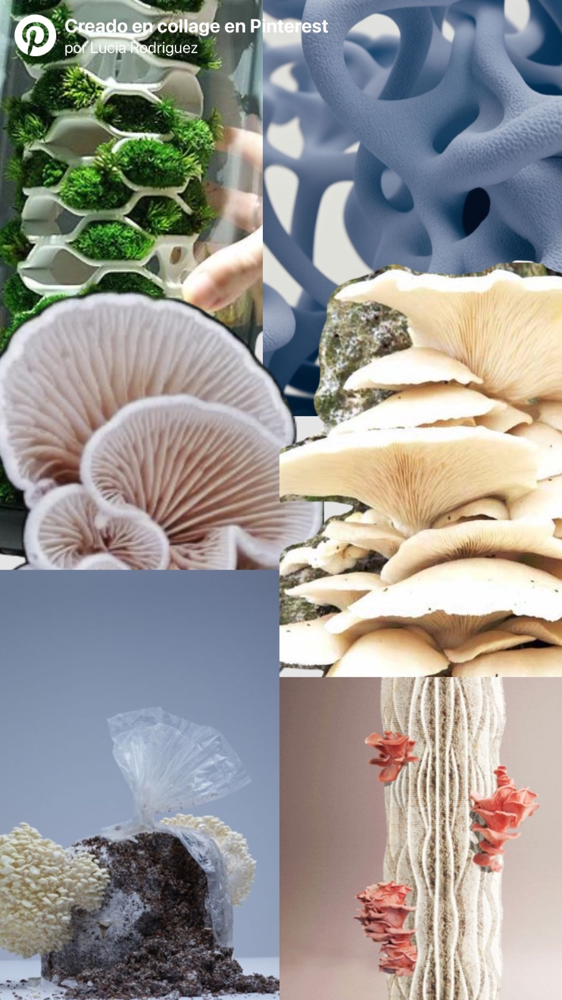

Realicé bocetos en papel, pero no sabía por dónde empezar con el programa de fushion así que busqué un tutorial de una estructura que fuese sencilla pero que tuviera alguna similitud con mis ideas. 

Probé un tutorial de una maceta facetada, en Fushion 360 entendí varias herramientas básicas.
Como generar el volumen con la herramienta de extruir, a unir piezas separadas "coser".
Luego de generar el volumen pude realizar una tapa que funcionara con el volumen. 
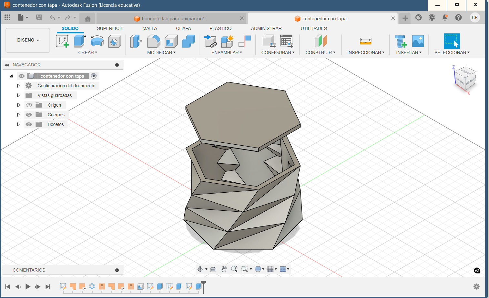

Luego de entender ciertas herramientas generé bocetos: 
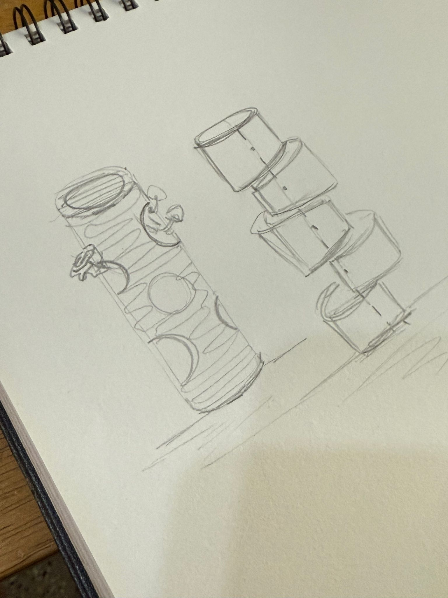

En medio de esto tuvimos las clases de Jorge que me ayudaron mucho a entender la lógica del programa.

- Generamos volúmenes a partir de gráficos ayudandonos con las restricciones y geometrías simples.
-Insertamos gráficos vectoriales, y los transformamos en bajo o alto relieve, pudimos ver las capacidades del programa y como chequear que cantidad de detalle podría ser imprimible o no. 
- También trabajamos con la creación de un volumen a partir de un Canva.

Comencé a intentar trazar mi propuesta, tratando de aplicar lo que había aprendido hasta ahora, generé un cilindro hueco, pero a la hora de hacer las perforaciones no lograba el resultado que esperaba.

Seguí los pasos de este tutorial para comenzar a trabajar. 

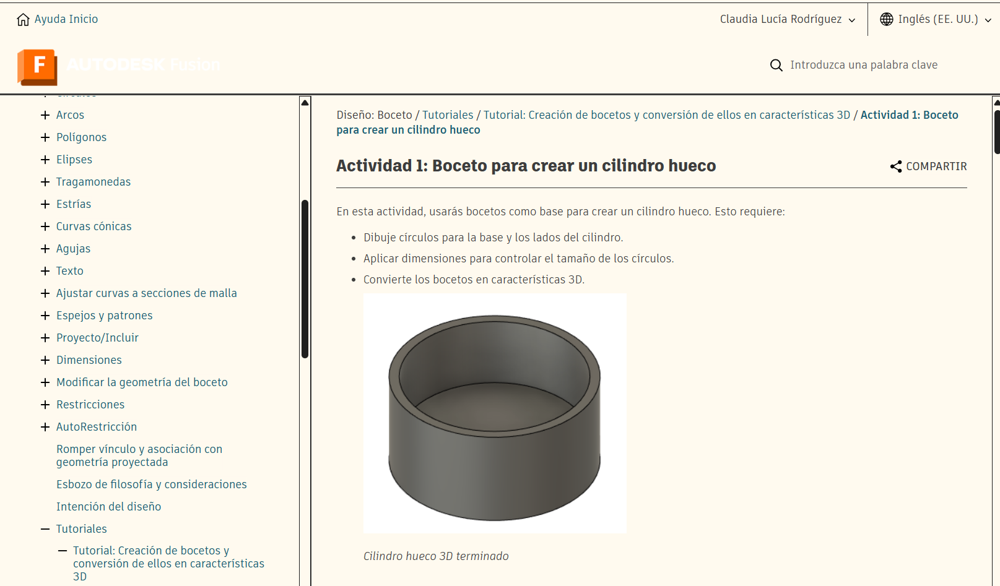

Algunas capturas del primer resultado: 

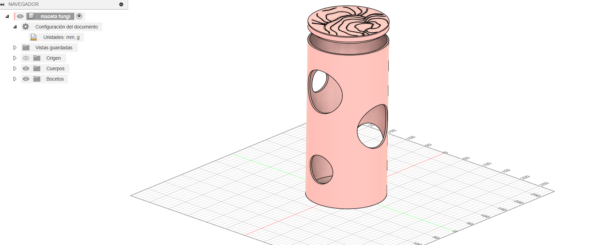

Los círculos huecos los generé con la herramienta de generar agujeros, pero solo podía realizarlos sobre ejes específicos, y mi idea era que fueran aleatorios y no tan estructurados. 
 
Mi idea era que el cuerpo tuviese una textura y no podía encontrar la manera de realizarlo sobre la pieza ya armada. 

vista superior y vector aplicado

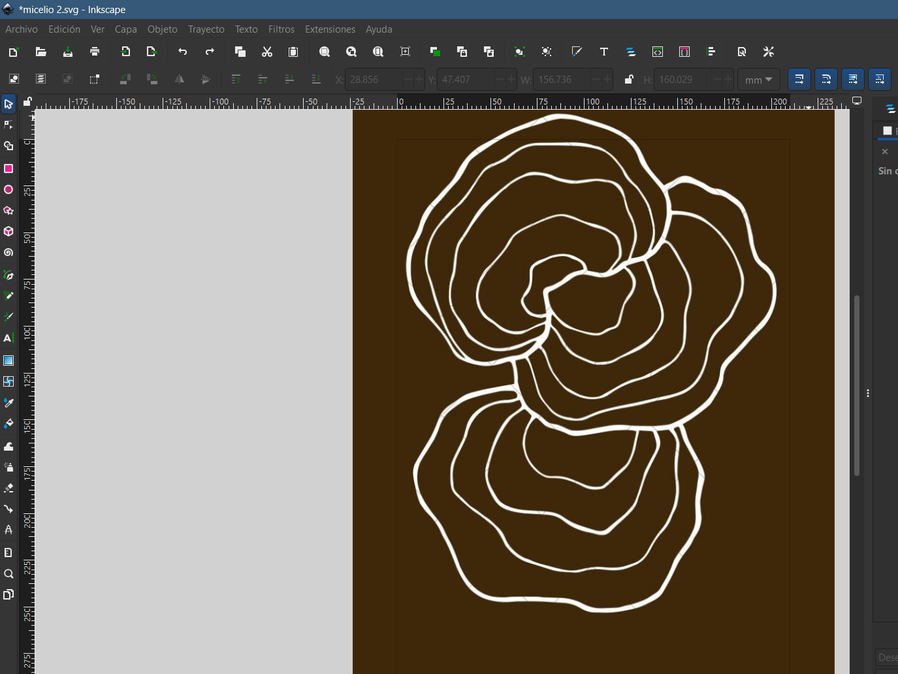
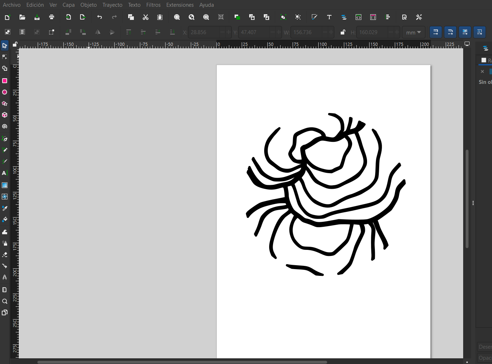

Vista posterior.

No me sentía satisfecha con el resultado asique seguí buscando otras alternativas:

Encontré algunos tutoriales que hablaban de desplegar la forma de esa maner podía aplicar el recurso de traer un vectorial que con la textura que quisiera y aplicarla al volumen. 
Este ejemplo mostraba como hacer un rodillo texturizado. 

Entonces, armé el cilindro a partir de un cículo pero luego le dejé una mínima abertura, luego usé las herramientas de chapa para darle grosor y poder desplegarlo: 

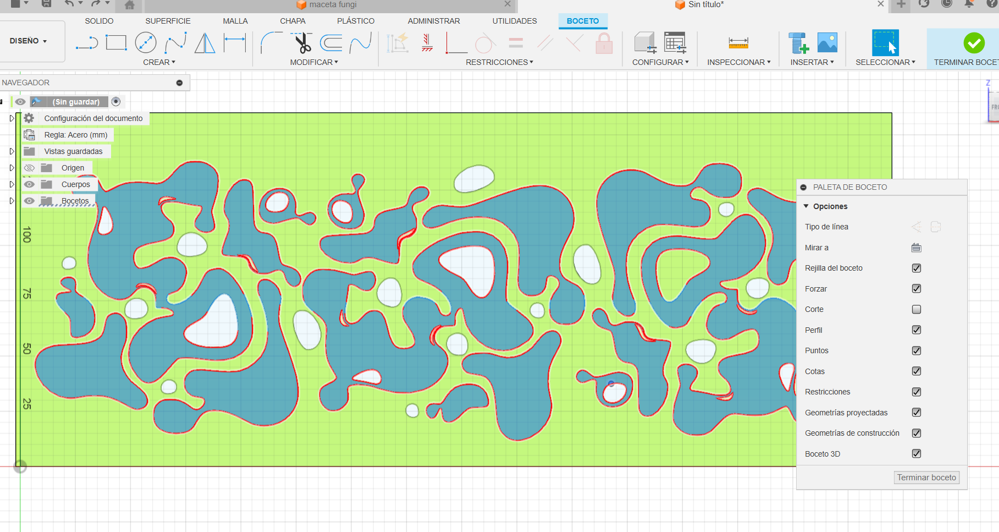
El vector lo generé a partir de una imagen dentro de Inskape, generé un rapport, y pude seleccionar las formas que quería calar y luego las que serían parte de la textura. 
 
 Me pasaba que cuando volvía a plegar la forma me quedaba la textura en el interior, luego de analizarlo mil veces entendí que había que generar la extruccion en negativo para que el diseño quede en el lado posterior, porque si trabajaba en la cara posterior del dibujo no podía seleccionar los vectores. 

 Imágenes del error: 
 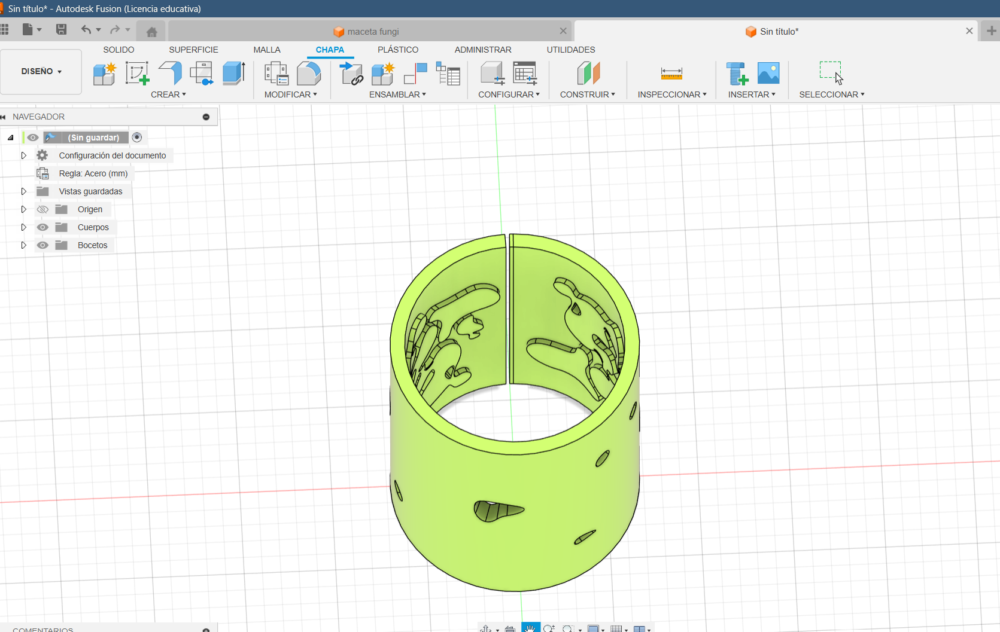

 Lo solucioné y apliqué extrucción para cerrar la pestañita que me permitía desplegar la forma. 

 Luego armé la base del cilindro y la tapa. 
 

 Hice pruebas para darle materialidad. 
 Hubieron detalles que no logré realizar, por ejemplo biselar las curvas, probé un monton de cosas pero el programa colapsaba y creo que no encontré la manera adecuada. 

  

  Luego para generar una imagen un poco más realista, probé las herramientas de renderizado. 
  Sin saber mucho del tema, encontré tutoriales que me guiaron, pero simplemente seleccioné formas y asiguné texturas y colores. 
  Generé un atmósfera con una iluminación que viene predeterminada, pero el recurso me pareció muy bueno, me quedé con ganas de seguir probando cosas. 
  
  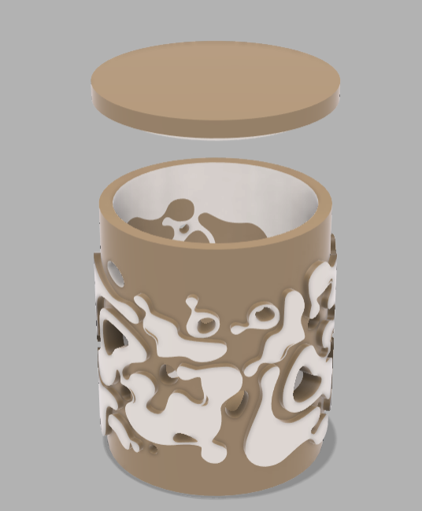

  Luego pasé a generar las imágenes para la lámina de entrega, la cual la realicé en illustrator.

   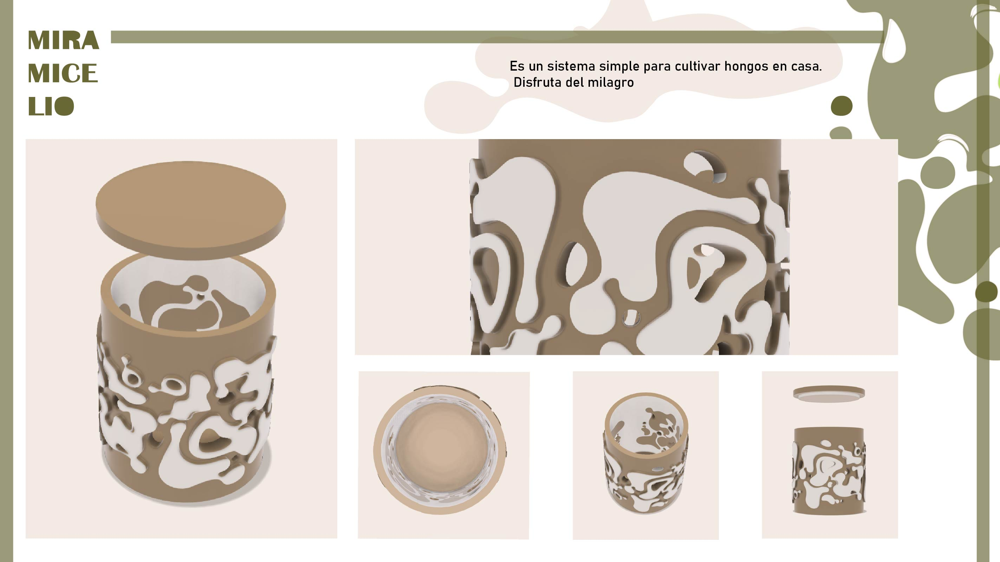

   El producto es un sistema simple de cultivo de hongos, se coloca el sustrato inoculado con las esporas de hongos y los hongos fructificarían por los huecos que tiene el contenedor. 

Me hubiese gustado poder sumar a la lámina elementos que expliquen el proceso y o implementación. 
Sería un siguiente paso trasformar este dispositivo en un objeto modular. 
me interesa buscar alternativas en biomateriales, tal vez generando un molde para fabricarlo residuos orgánicos. 

  
 

