---
hide:
    - toc
---

# MT03

En esta unidad abordamos la tecnología de corte láser controlado por computadora.

El corte láser es un proceso *sustractivo* es decir: un haz de luz elimina material siguiendo una trayectoria digital predefinida. 

Las cualidades de esta tecnología son:

*Exactitud    Velocidad   Versatilidad de materiales*

Conceptos importantes:
cnc (control numérico computarizado).

Mecanismo de posicionamiento cartesiano 2D (XY)

## Tipos de Cortadoras láser

### Láser CO2

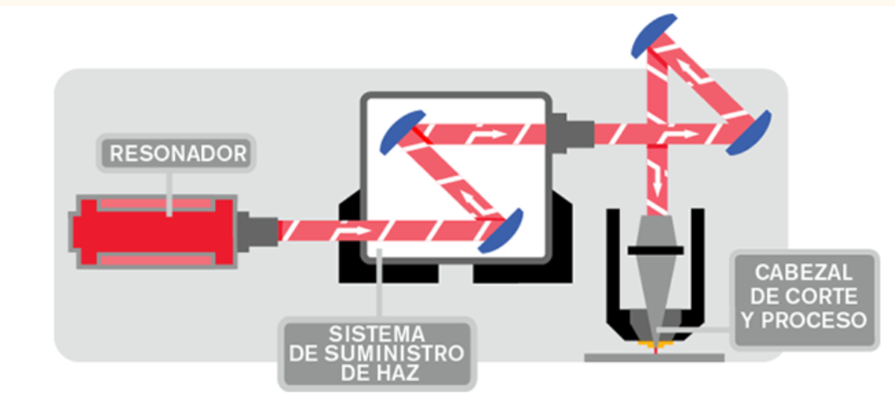

En este caso el láser es generado por gases (dioxido de carbono), el cual es
"encendido"
mediante corriente eléctrica (entre 20000 y 25000 Volts).

Todo esto sucede dentro de un tubo, en el que se genera un campo eléctricos generado por electrodos
que están posicionados en los extremos de dicho tubo. En el
también funciona un sistema de enfriamiento Chiller.El que es necesario para dar estabilidad a la temperatura. 

El láser trabaja un una luz con determinada longitud de onda la cual aunque no la podemos ver puede dañarnos, 
 por lo que es importante tener presentes las medidas de *seguridad*:

- trabajar con la tapa de la máquina cerrada.

- usar protección adecuada,
  lentes o solo observar por el cristal.

Nosotros debemos trabajar un un dibujo vectorial el cual a travéz del 
 programa de la cortadora laser traducirá en una trayectoria,
 mediante parámetros establecidos por:
 la velocidad,
 la potencia y el mecanismo de posicionamiento, logrado cortar o grabar nuestro diseño. 

Regulando la potencia y velocidad podemos regular  la profundidad de grabado y/o corte que realizamos, el efecto de estos controles va a depender de factores variables como la máquina y los materiales con los que queremos trabajar. 

Con el enfoque también podremos dar efectos de un borde más grueso sin necesidad de generar un grabado para ello. 

Lo que queda claro es que cada trabajo deberá tener un momento de prueba o ensayo para poder lograr el resultado que requerimos,
porque si bien el sistema es preciso la variedad de condiciones y materiales genera resultados variables. 

Materiales
 Laser CO2: 
- Madera
- Acrílico
- Cuero o textiles

Referencias interesantes:

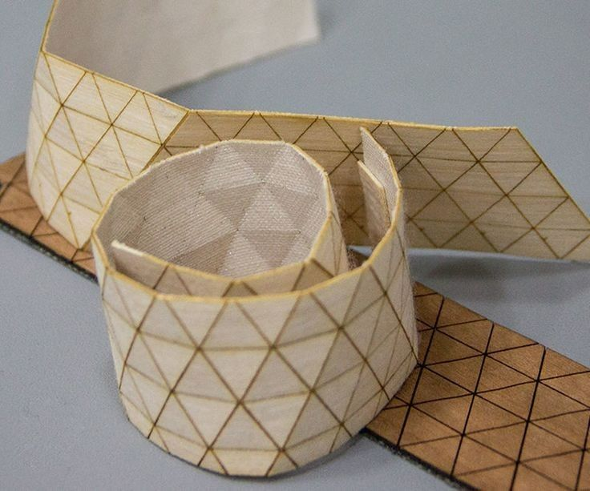

### Láser fibra óptica

Es un tipo de láser de estado sólido, potente y preciso. Es un corte eficiente en cuanto al consumo de energía y es más utilizado en materiales como el metal. 

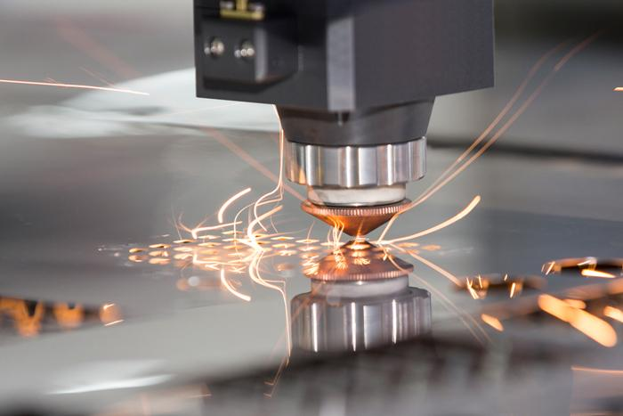

### Láser neodimio

Este láser
 tiene una longitud de onda mucho más reducida y una intensidad más alta en comparación con los láseres de CO2. Esto permite el corte con láser a través de materiales más gruesos y robustos como los metales y algunas cerámicas. La desventaja que presenta este tipo de láser es que las piezas de la máquina se desgastan muy rápidamente, lo que hace que se necesite un mayor grado de mantenimiento.

Entiendo que es un tipo de máquina que se utiliza más en industria. 

## Generación de archivos para corte láser

Teniendo en cuenta la información anterior
debemos que aprender a generar los
archivos que necesitamos para poder trabajar con esta técnología, trabajamos con Joaquín en el armado de un archivo en fushion 360 y el desglose de piezas en un programa de 2D (por ejemplo illustrator o gimp) 

Entonces, para este ejemplo trabajamos a partir del volumen, aplicando conceptos de diseño paramétrico, es decir generamos reglas y restricciones que hacen que nuestro diseño pueda modificarse automáticamen en funcion a esos "parámetros" por ejemplo: el espesor del material. 

Comenzamos asignando parámetros:
Lado 100mm 
Espesor 3mm
Comenzamos trabajando en un plano lateral asignando su posición con el parametro lado/2
Para trazar los lados del scketch usamos  el parametro Lado y para generar las formas de encastre usamos el parámetro espesor.
Restringimos los lados y las piezas que debían ser iguales, esto genera que si modifico un aspecto del dibujo todo se verá afectado. 

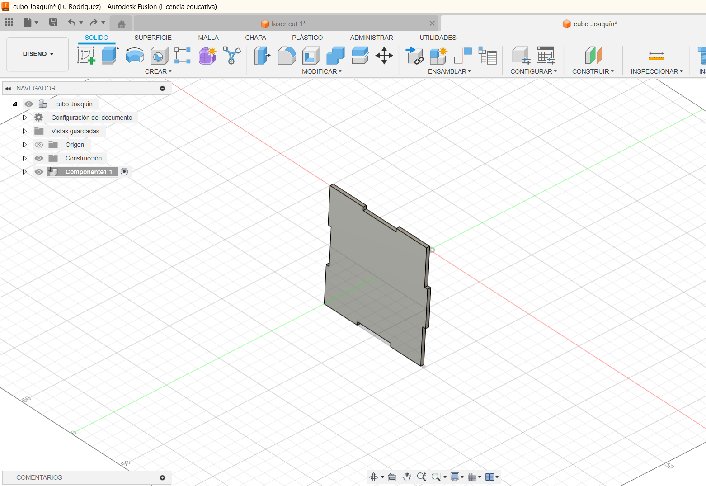

Luego de generar la forma deseada,
extruimos el boceto con el parámetro espesor. 

Después
 utilizamos la herramienta patrón circular, definimos la cantidad de lados (en este caso 4) y obtenemos los cuatro lados del cubo.

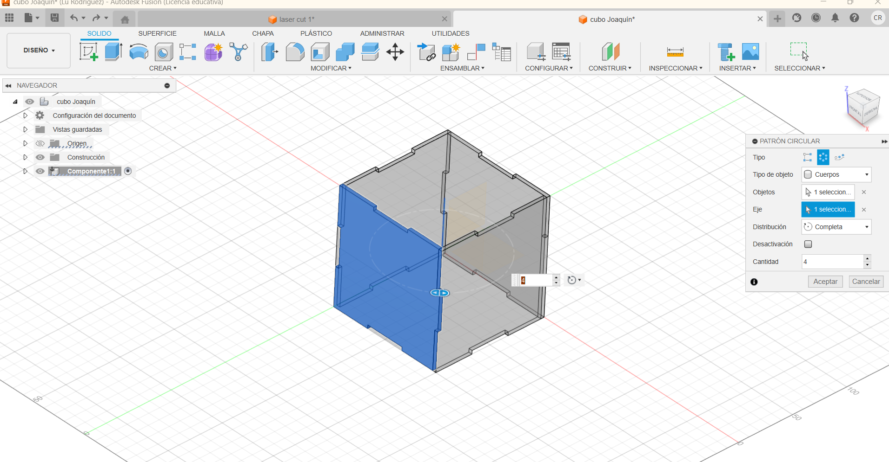

Para dibujar las tapas utilizamos la herramienta proyectar sobre el plano superior, luego extruimos la forma con el comando expesor nuevamente, aquí tuve que tener la precaución de seleccionar la opción "cuerpo nuevo" para que no unificara las piezas en un solo cuerpo. 

A partir de la tapa superior, urilizamos la herramienta de simetrizar y generamos la pieza de la base.

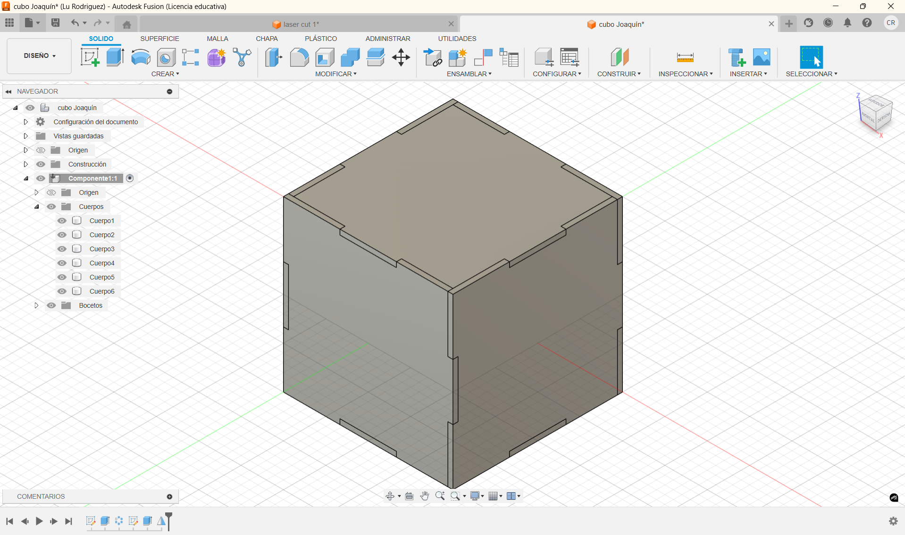

Pasamos al momento de crear el nesting, para usar esta funcion previamente debemos convertir los objetos en componentes, una vez realizado este paso
(clic derecho sobre el objeto>crear componente) podemos utilizar la herramienta *"organizar"*, seleccionamos el plano en el cual nos va a distribuir las piezas, podemos alterar los datos de margen y tamaño de lienzo a utilizar, aceptamos los cambios y logramos ver las piezas en plano. 

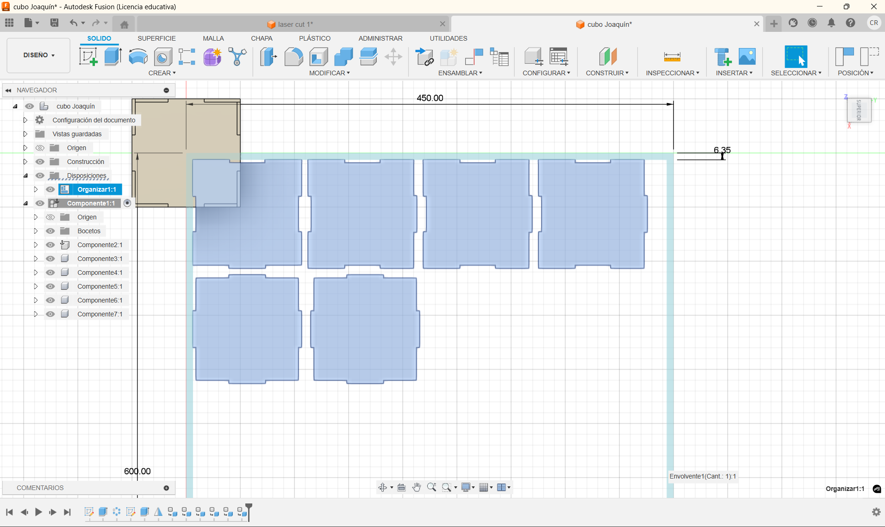

Entonces con esta disposición de las piezas crearemos un nuevo scketch para poder exportar como DXF, usamos la herramienta de proyectar y lo veremos como en la siguiente imagen:

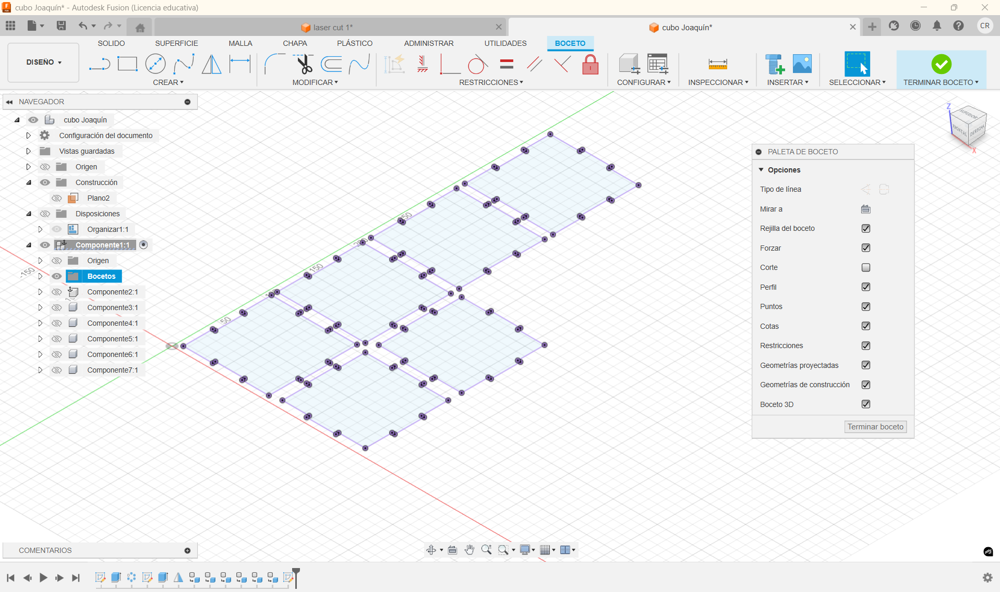

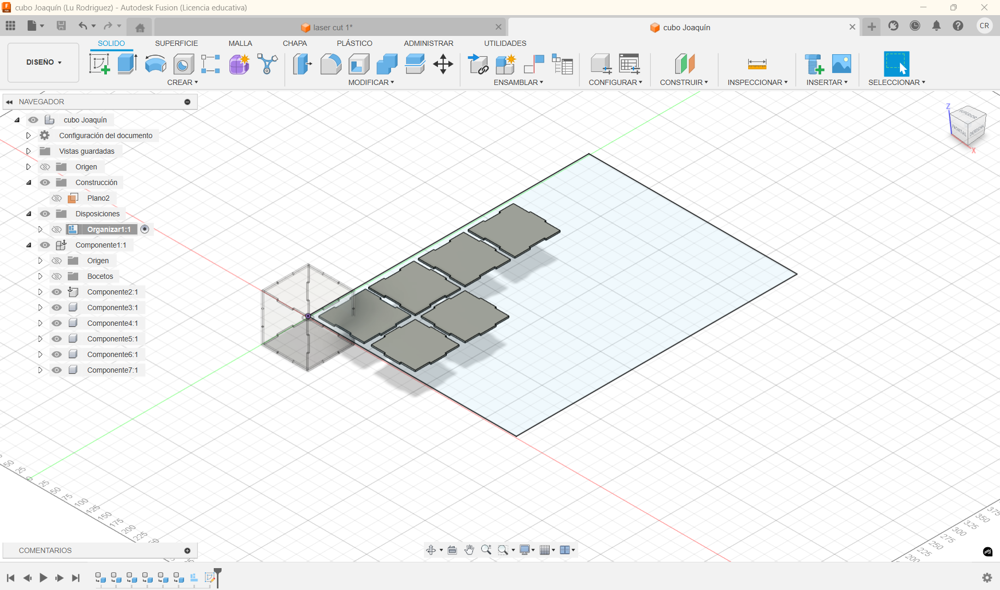

En mi caso dibujé un rectángulo con las medidas de la cama que vamos a utilizar para ya exportar el archivo contemplando esas proporciones. 

Luego de realizar estos pasos, se exporta el Dxf lo guardamos en nuestro disco y pasamos a abrirlo en un programa vectorial, en mi caso utilicé Illustrator. 

Aquí debemos separar el archivo en capas de acuerdo a la acción que queremos que realice la máquina, esto luego será interpretado 
 por el softwear CAM de la siguiente forma:
 
- Capa Azul: Corte
- Capa Verde: Raster (imagen)
- Capa Roja: Grabado. 

 (Dependiendo del softwear o máquina estos códigos pueden ser diferentes)

En el programa vectorial podemos generar dibujos o adaptar las imágenes al archivo con mayor libertad o fluidez. 

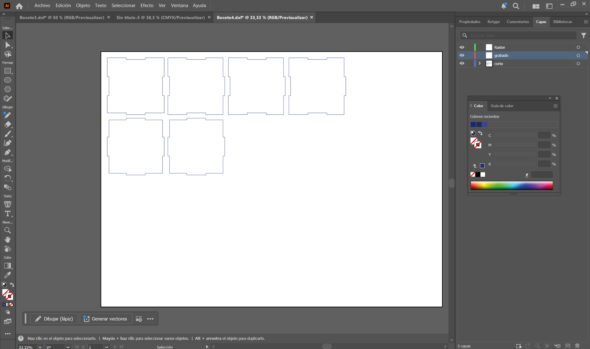

DXF importado

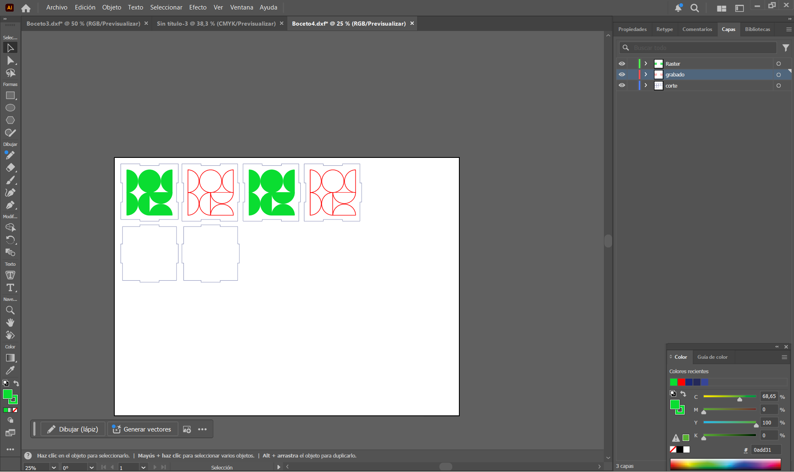

DXF con modificaciones y capas. 

## Ejercicio planteado. 

Consiste en diseñar un volumen para cortar en láser. La consigna exije, al menos 3 piezas, trabajar con parámetros en fushion, utilizar las 3 herramientas del láser: Corte, grabado y raster. 
También se nos anima a trabajar con la técnica de kerfing. 

Comienzo con análisis de formas y búsqueda de herramientas. 
En este punto entiendo que el fin es experimentar con la herramienta pero a la vez sería adecuado buscar algo aplicable a la temática del proyecto. 

Kinetica (poner info) 
Kerfing 
Pegado 

En algún momento del proceso por mi cabeza pasa la idea de cómo podría potenciar el cultivo de los hongos una forma  o cúpula geodesica aprovechando las condiciones del volumen
que favorecen el control de la humedad y la temperatura, por lo que luego de barajar entre las infinitas opciones decido experimentar con este tipo de volúmenes. 

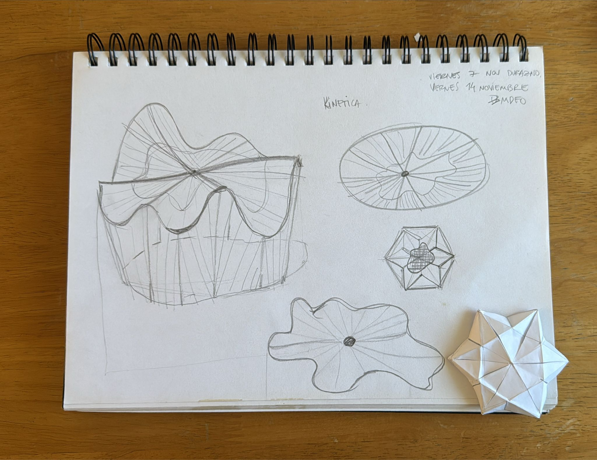

Para imaginarme el volumen trabajé con una maqueta de papel algo improvisada, en este proceso me pareció conveniente que los módulos fuesen triangulares para tener mejor aprovechamiento del material, probé distintas opciones y fui probando que texturas podrían ser aplicable a cada superficie.

También entendiendo que para trabajar con módulos debía resolver un sistema de encastres, el cual al tener planos que no son perpendiculares ni paralelos no podrían estar sobre las piezas.Debo generar una pieza aparte.

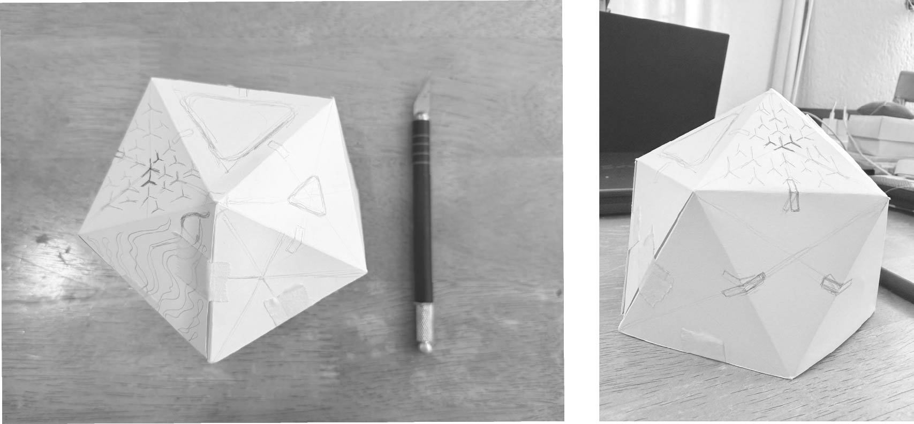

Me pasé a trabajar en Fushion buscando un proceso algo más autónomo con respecto a los anteriores. 
El plan es:
- Aplicar parámetros: Lado y Espesor.
- Trabajar planos paralelos a la base para lograr la variación de ángulos que necesito.
-Aplicar la herramienta de patron circular repetir las piezas. 
- Intentar generar el patrón para realizar el kerfing. 

En este proceso, probé las ideas que tenía en mente, pero no podía trabajar con planos que fuesen paralelos a laos ejes, hice varias pruebas.
agrego los resultados, en ellos no podía trabajar con los ángulos.

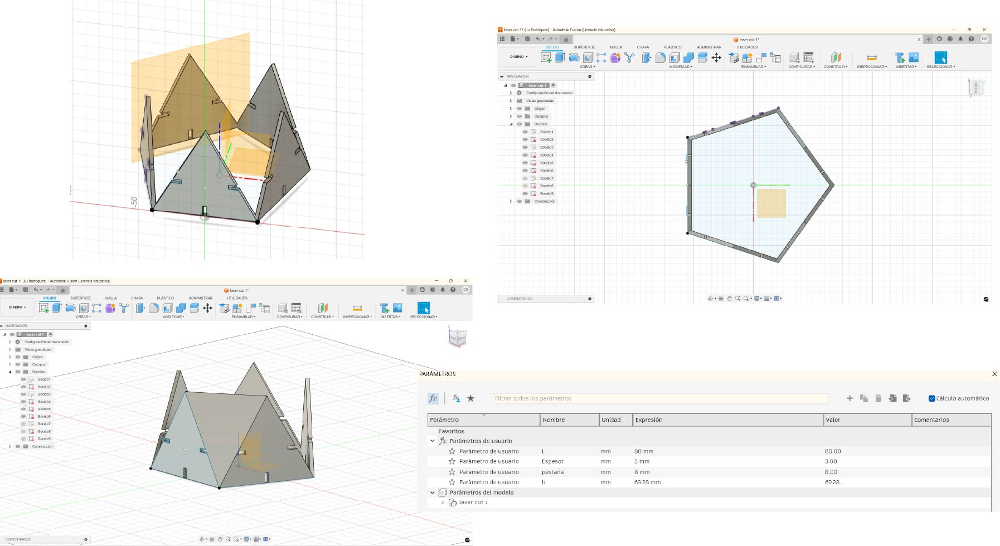

