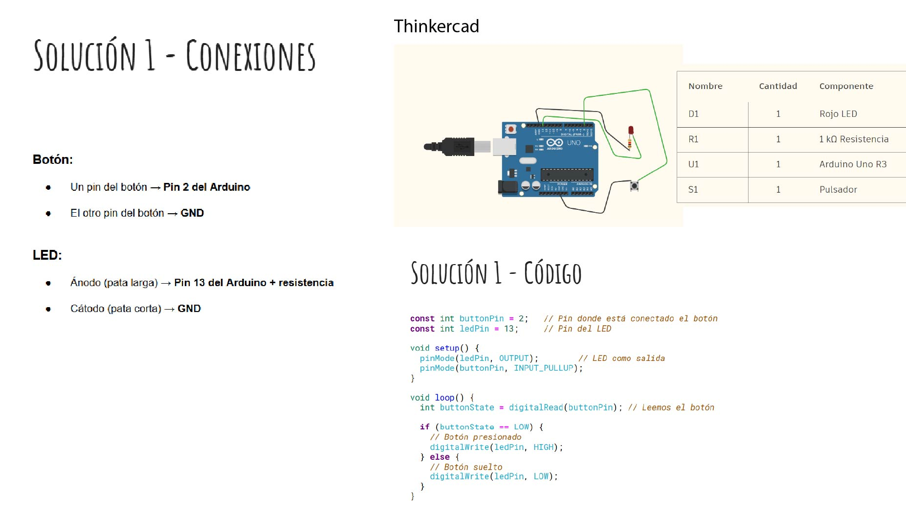

---
hide:
    - toc
---
# MT04

### Módulo técnico 04 
En este módulo trabajamos con arduino y comenzamos a adquirir herramientas básicas de electrónica para poder aplicar a nuestros proyectos, es un desafío entrar en un mundo tan diferente  a la formación previa. Seguimos aprendiendo de códigos binarios y programación.

### Conceptos básicos de electricidad 

**Átomo**
En un átomo, el núcleo mantiene unidos a los protones y neutrones, mientras que los electrones orbitan alrededor de ellos:

**Voltaje**
Cuando forzamos a los electrones a agruparse en un área determinada, dejando otra área sin electrones, creamos una diferencia de voltaje. Este voltaje es la relación entre la energía que aplicamos y la carga eléctrica:

_E = V x carga_

Cuando dos objetos tienen una diferencia de voltaje, podemos decir que sus electrones intentarán saltar entre sí creando un flujo de corriente, para equilibrar la situación y estabilizarse. El voltaje se expresa en voltios (V). Este voltaje puede ser constante en el tiempo o alterno.

La energía se mide en Jules (J), el voltaje en Voltios (V) y la Carga en Coulombs (C).

**Corriente eléctrica**

Cuando dos objetos están sujetos a una diferencia de voltaje, los electrones intentarán volver a su posición. Al hacerlo, decimos que hay una corriente eléctrica o simplemente corriente. Este movimiento de electrones dentro de un material se mide en amperios (A) o simplemente amperios. Si tenemos tensión alterna, también tendremos corriente alterna (AC), y lo mismo con tensión constante, en cuyo caso tendremos DC.

**Ley de Ohm**

Para que los electrones pasen de un punto a otro cuando estén sujetos a voltaje, tendrán dificultad de atravesar. Esa dificultad se llama resistencia y se mide en ohmios (Ω).

V = I x R

Significa que cuando la resistencia es muy alta, casi no hay corriente (y cuando la corriente es 0, significa que tenemos un circuito abierto). Cuando la resistencia es casi 0, la corriente puede ser muy grande, lo que lleva a lo que llamamos un corto.

Lo bueno de esto es que podemos controlar este flujo (o la falta de él) para generar circuitos que hagan funcionar lo que queremos. 

### Arduino

Luego de ver estos conceptos básicos pasamos a entender Arduino, de que se trata y algunas aplicaciones que pueden aportar a nuestros trabajos. 

**Arduino, qué es?**

Arduino es una plataforma de código abierto que combina dos elementos clave:

* Hardware físico: Una placa de circuito programable (microcontrolador).
* Software (IDE): Un entorno de desarrollo que instalas en tu computadora para escribir y cargar instrucciones en el microcontrolador.

La magia ocurre cuando la placa Arduino recibe tus instrucciones, como encender un LED o mover un motor.

¿Cómo lo hace? Gracias al lenguaje de programación basado en Wiring y al IDE inspirado en Processing, que convierten tareas complejas en procesos simples y accesibles.

**Placa Arduino1** 

Resumen de sus partes:

**(1 y 2) Alimentación USB y fuente de 5VDC**
La placa Arduino UNO puede ser alimentada de dos maneras principales:

A través de un cable USB tipo B o mini, conectado directamente a tu ordenador.
Mediante una fuente de alimentación externa con un rango de entre 6V y 18V, utilizando el conector de energía integrado. (power bank)

Además de suministrar energía, la conexión USB tiene otra función esencial: permite cargar el código desde el ordenador a la placa Arduino.

A través de esta conexión, puedes transferir datos e instrucciones de programación directamente al microcontrolador, dando vida a tus proyectos de manera sencilla y práctica.

**(3)Regulador de voltaje**
El regulador de voltaje es un componente esencial de la placa Arduino.

Su función principal es controlar y estabilizar la cantidad de voltaje que ingresa a la placa, garantizando que los circuitos internos reciban la energía adecuada.

Gracias a este regulador, se evita que un exceso de voltaje pueda dañar los componentes electrónicos, protegiendo así el correcto funcionamiento de tu proyecto.

**(4) Conexiones** 
Los pines de Arduino son puntos clave para construir circuitos electrónicos, ya que permiten la conexión de los cables necesarios para integrar distintos componentes.

Cada uno de estos pines tiene una función específica, claramente identificada en la placa.

**Reset**: Este pin permite reiniciar el microcontrolador, deteniendo y reiniciando el código cargado.
**5V y 3.3V**: Proporcionan energía a los componentes conectados. El pin de 5V suministra 5 voltios, mientras que el de 3.3V suministra 3.3 voltios.
**GND (Ground)**: Los pines GND se usan para conectar a tierra el circuito, garantizando una referencia común para la corriente eléctrica.
**VIN**: Este pin permite alimentar la placa mediante una fuente externa que suministre entre 6 y 12 voltios de corriente continua (VDC).
Estas conexiones son la base para interactuar con sensores, actuadores y otros dispositivos, haciendo que tu proyecto cobre vida de manera eficiente y segura.

**(5) Puertos de entrada analógicos**
Los pines etiquetados como ‘Analog In’ son esenciales para trabajar con señales analógicas.

Su función principal es leer las señales enviadas por sensores analógicos y convertirlas en valores digitales que el microcontrolador puede interpretar.

Por ejemplo, si conectas un sensor de temperatura, este generará una señal analógica basada en las variaciones de temperatura, y los puertos analógicos transformarán esa señal en un valor digital que podrás usar en tu programación.

Esto permite medir variables físicas como luz, temperatura o presión con gran precisión y adaptarlas a tus proyectos.

**(6) Micro-controlador Atmega 328**
El microcontrolador ATmega328 es el corazón de la placa Arduino, actuando como su cerebro principal.

Este circuito integrado es el encargado de ejecutar el código que programas, procesar las instrucciones y controlar las interacciones entre los componentes conectados.

Gracias a su diseño eficiente, el ATmega328 permite manejar desde tareas simples, como encender un LED, hasta proyectos más complejos, como la automatización de sistemas o la comunicación con múltiples sensores y actuadores.

**(7) Entrada ICSP (In Chip Serial Programmer)** 
La entrada ICSP es un puerto especializado que permite grabar programas directamente en el microcontrolador de la placa Arduino sin utilizar el puerto USB.

Este método es especialmente útil en situaciones avanzadas, como cuando necesitas reprogramar el bootloader o cargar códigos en placas que no disponen de conexión USB.

**(8) LED indicador de alimentación**
El LED indicador de alimentación se ilumina cuando la placa Arduino está recibiendo energía y el microcontrolador está activo.

Si el LED no se enciende, es una señal de que algo podría estar fallando en la alimentación o en la conexión de la placa.

**(9) LED TX RX**
Los LEDs TX (Transmisión) y RX (Recepción) son indicadores visuales que muestran la actividad de comunicación serie en la placa Arduino.

TX (Transmisión): Se ilumina cuando la placa está enviando datos al ordenador u otro dispositivo conectado.
RX (Recepción): Parpadea cuando la placa está recibiendo datos externos.
Estas marcas son comunes en dispositivos electrónicos y resultan especialmente útiles para diagnosticar la interacción entre Arduino y otros sistemas.

Si ambos LEDs parpadean, significa que hay un intercambio activo de datos, lo que confirma que la comunicación funciona correctamente.

**(10) Puertos digitales**
Los puertos digitales de Arduino son pines versátiles que se pueden utilizar tanto como entrada como salida:

Entrada digital: Permiten leer señales digitales, como la pulsación de un botón o la activación de un sensor que emita valores de encendido/apagado (0 o 1).
Salida digital: Controlan dispositivos externos, como encender o apagar un LED, activar un motor o enviar señales a otros componentes.
Gracias a estos pines, la placa Arduino puede interactuar fácilmente con el entorno y dar respuesta a diversas necesidades en tus proyectos.

**(11) Puerto de conexiones**
El puerto de conexiones de Arduino está compuesto por diversos pines diseñados para cubrir diferentes funciones auxiliares.

Principales características:

Entradas o salidas auxiliares (pines 8 a 12): Utilizados para conectar componentes adicionales según las necesidades del proyecto.
Salidas PWM (pines 9, 10 y 11): Permiten la modulación por ancho de pulso (PWM), ideal para controlar la velocidad de motores, variar el brillo de LEDs o manejar otros dispositivos que requieran señales analógicas simuladas.
Salida 13: Este pin está conectado directamente a un LED integrado en la placa, facilitando pruebas rápidas sin necesidad de componentes externos.
Salida a tierra (GND): Se utiliza para conectar el circuito a tierra, una referencia esencial para garantizar el funcionamiento eléctrico adecuado.
Pin AREF (Analog Reference): Permite establecer una tensión de referencia externa (entre 0 y 5V) que define el límite superior de las lecturas en los pines de entrada analógica.
**(12) Chip de Arduino **
El chip de Arduino actúa como el “DNI” de la placa, permitiendo que el ordenador reconozca el dispositivo cuando se conecta mediante el puerto USB.

Este componente es responsable de gestionar la comunicación entre la placa y el ordenador, asegurando que se establezca una conexión adecuada para cargar códigos, intercambiar datos y ejecutar instrucciones.

Sin este chip, el ordenador no podría identificar ni comunicarse correctamente con la placa Arduino.

**(13) Botón de RESET**
El botón de Reset es una herramienta sencilla pero muy útil en la placa Arduino. Al presionarlo, se conecta temporalmente el pin de reset a tierra, lo que reinicia el microcontrolador y ejecuta nuevamente el código cargado en la placa desde el inicio.

### Laboratorio Arduino

Para esta etapa trabajamos en modalidad prescencial en un salón del Latu, cada estudiante disponía de un kit de Arduino para trabajar. 
Anteriormente habíamos probado y simulado circuitos mediante Tinkercad en las clases sincrónicas pero esta etapa vivencial aportó lucidés a los conceptos que veníamos trabajando. 

Primero abrimos el programa de arduino y corrimos el  "hola mundo" para asegurarnos que la placa y el programa de arduino se conectaran. 

Realizamos un total de 5 ejercicios que nos planteó Mathías y en cada etapa fuimos complejizando las tareas y sumando diferentes recursos.

### Ejercicio 1

Programar el Arduino para que lea un botón y encienda un LED únicamente mientras el botón está presionado.
Cuando el botón se suelta, el LED debe apagarse.

Lo primero que hacemos es comenzar por las instrucciones y conectar los cables como lo indica, copiar el código en el programa de arduino, complilamos o verificamos el código, (así si hay incongruencias el programa ya lo detecta).
Luego de este paso conectamos el arduino al USB de la máquina y corrermos el programa y ahí sucede la magia:

<iframe width="315" height="576" src="https://www.youtube.com/embed/BKTMLS0Olpg" title="ejercicio 1 arduino" frameborder="0" allow="accelerometer; autoplay; clipboard-write; encrypted-media; gyroscope; picture-in-picture; web-share" referrerpolicy="strict-origin-when-cross-origin" allowfullscreen></iframe>

### Fuentes que utilicé para completar este registro: 

Material en moodle Mt04 https://ev1.utec.edu.uy/moodle/mod/book/view.php?id=693250

https://www.cursosaula21.com/arduino-todo-lo-que-necesitas-saber/

