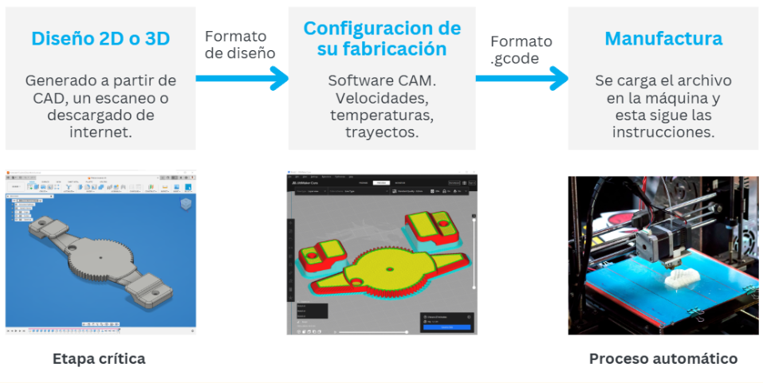
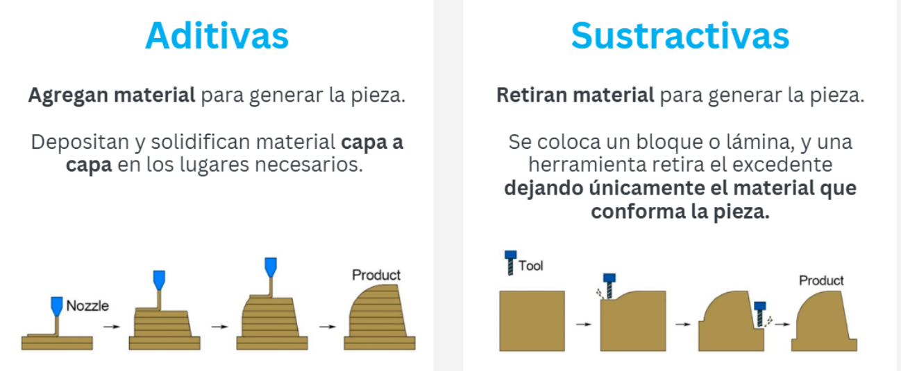
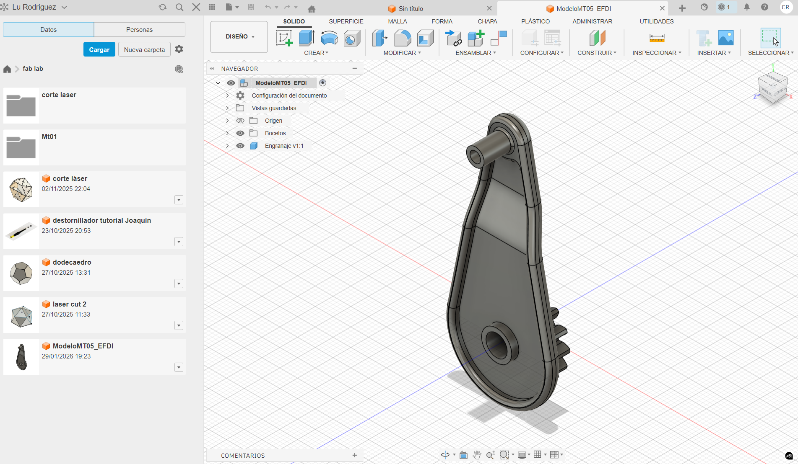
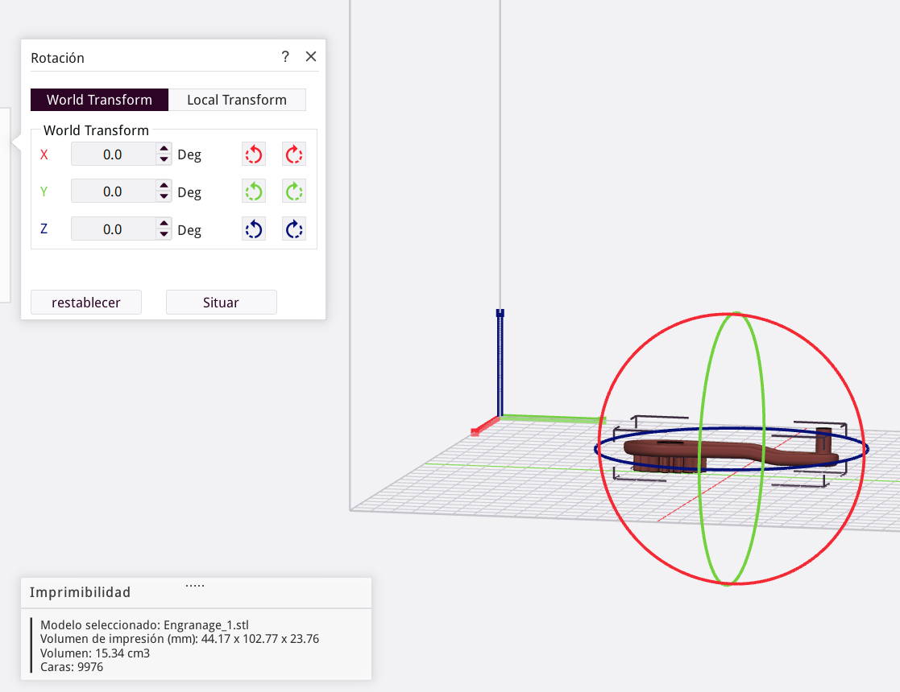
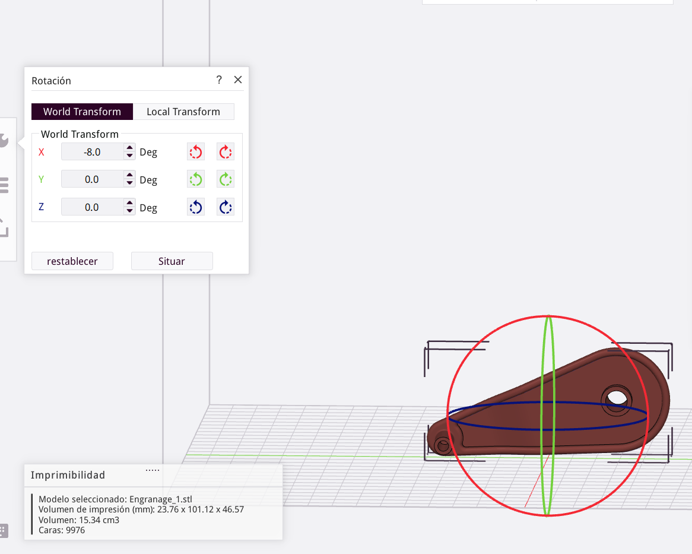
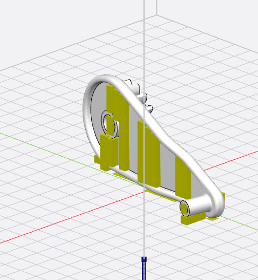
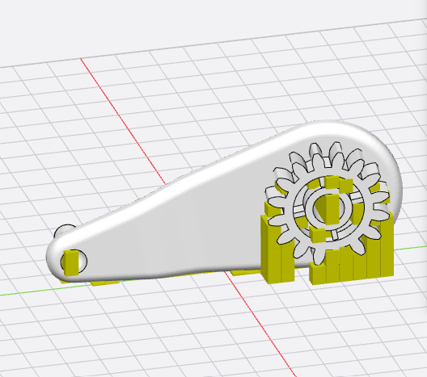
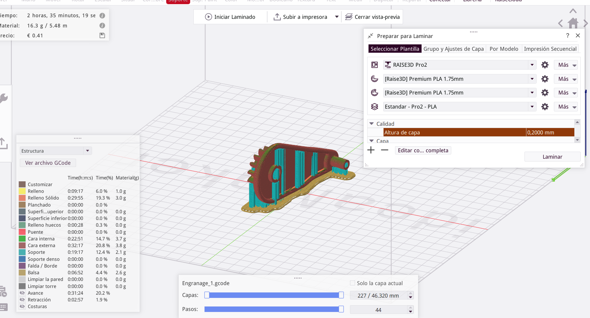

---
hide:
    - toc
---
# MT05

### Impresión y escaneo 3D

Fabricación digital aditiva 

Resumen de contenidos 

### CAD&CAM

Cuando hablamos de CAD nos referimos al software que utilizamos para definir el diseño en formato digital, ya sea en 2D o en 3D: la geometría, las medidas, las relaciones entre piezas y las condiciones que debe cumplir el objeto.

CAM, en cambio, es el conjunto de herramientas que traducen esas geometrías en instrucciones específicas que una máquina de control numérico computarizado (CNC) puede ejecutar: movimientos, velocidades, alturas de capa, temperaturas, trayectorias y demás parámetros de operación.

El archivo resultante —generalmente un .gcode en el caso de impresión 3D— funciona como puente real entre el diseño y la producción, entre la intención de proyecto y su materialización física.

### Impresión 3D- fabricación aditiva

Es un proceso de fabricación en el que un objeto se construye agregando material capa por capa siguiendo una geometría digital previamente definida. Por esta razón se la clasifica dentro de la fabricación aditiva.

### Características

- Elaboración bajo demanda. Permite modificar el diseño entre una impresión y otra, logrando artículos personalizables. 
(ej.: jollería, hortodoncia, plantales o plantilla, prótesis, etc )

- Complejidad y personalización.
El costo está más ligado al volumen de material y al tiempo de máquina que a la complejidad formal.
Series en las que cada objeto puede ser distinto sin cambiar de herramienta.

- Fabricación compacta y distribuida
Ocupa poco espacio y requiere infraestructura mínima. 
Teniendo la posibilidad de distribuir la producción en múltiples espacios y  fáciles de replicar.

- Precisión y repetibilidad. 
El nivel de detalle y precisión alcanzable depende de la tecnología (FDM, resina, SLS, metal, etc.) y de los parámetros del proceso, pero en muchos casos es suficiente para prototipos funcionales, utillaje e incluso piezas finales. 

- Costos y barrera de entrada.
Es posible diseñar y producir piezas complejas con equipamiento relativamente económico. Sin embargo los materiales pueden ser más costosos por kilo que los tradicionales, y el tiempo de máquina puede ser significativo. El diferencial está en la combinación de baja inversión inicial, ausencia de moldes y capacidad de ajustar el diseño casi en tiempo real.

### Limitaciones y desafíos de la impresión 3D

- Tiempo de fabricación y escala
La construcción capa por capa deriva en que la impresión 3D resulte ser significativamente más lenta que otros procesos como el moldeo por inyección, el estampado o incluso ciertos mecanizados.
Por lo que es más eficiente utilizar la técnología para prototipado, diseños personalizados o producciones de pocas piezas.

- Propiedades mecánicas y anisotropía
La unión entre capas suele ser el punto débil, lo que introduce anisotropía (comportamiento distinto según el eje) y limita el uso en aplicaciones sometidas a esfuerzos exigentes, fatiga o impacto. En estos casos, la impresión 3D puede complementar pero no siempre reemplazar a procesos como el mecanizado, la forja o el moldeo tradicional.

- Acabado superficial y postprocesos
Las líneas de capa, la presencia de soportes y ciertas imperfecciones superficiales son inherentes a muchos procesos aditivos.

### Tarea

Este ejercicio consta de seguir un paso a paso en el que pasaremos de un Dibujo 3D a una malla que luego podremos importar a un programa Cad y configurar ciertas instrucciones para imprimir en 3D. 

En primer lugar trabajamos con Idea maker, por lo que descargamos el programa y realizamos la instalación. 

A continuación descargamos un modelo diseñado en Fushion 360, en este programa exportamos un formato de malla.STL (binario)

Lo que sigue es importarlo en el softwear Cad posisionarlo convenientemente y luego escalarlo al 150%. 

Para la posición intenté buscar la parte más recta del diseño para dejarlo en contacto con el mat de la impresora, pensando en que cuanto más superficie tenga en contacto mejor será la estabilidad de la pieza al realizar la impresión. 
Probé varias opciones pero en todas se generan soportes auxiliares, está me pareció la mejor opción. 

seguro la pieza va a tener pasar por un proceso de limpieza y lijado, me preocula que el engranaje  no quede de todo limpio.  
En ese caso se podría intentar dejar la superficie de la rueda en contacto con el plano horizontal.
 

### Experimentación scanner