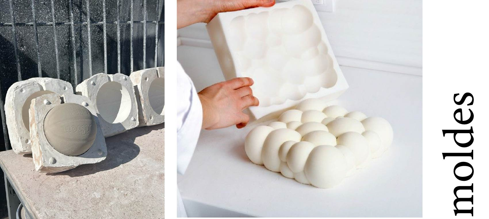
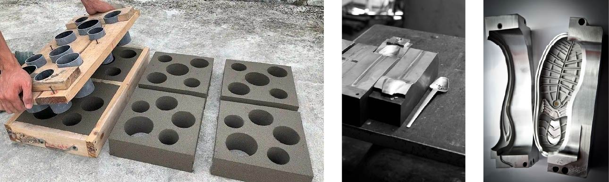
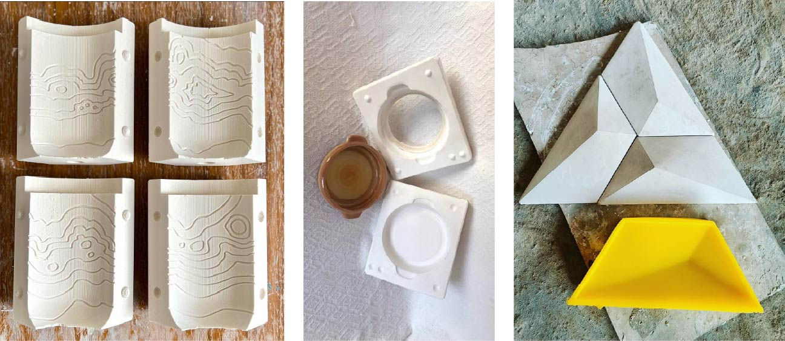
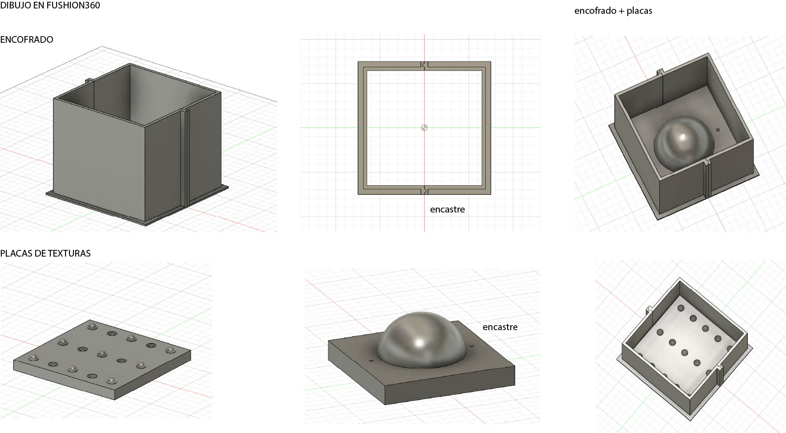
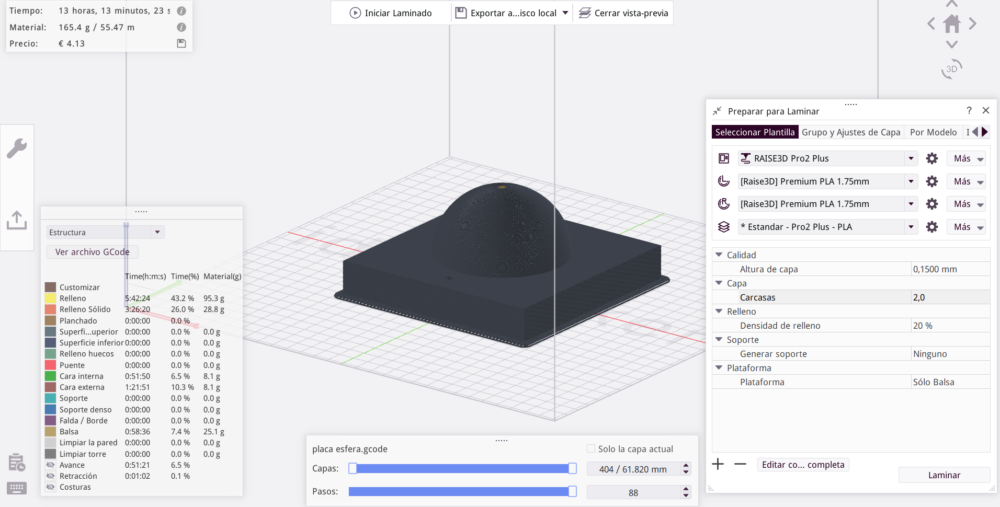

---
hide:
    - toc
---
# MT09

### Moldes *Un mundo fascinante*

Se define a un molde como una pieza (o un conjunto de ellas) con una cavidad interna que reproduce la forma y los detalles del objeto sólido que se desea obtener.

Como nos hace apreciar Santi, un molde puede ir desde una pieza muy sencilla a realmente versiones complejas, la versatilidad de la técnica es infinita y el resultado dependerá de los materiales y/o técnicas que combines para ello. 
La experimentación es el elemento clave para obtener resultados. 

En el ámbito industrial, también se les denomina matriz, mientras que en construcción el conjunto del molde y sus piezas auxiliares recibe el nombre de encofrado.

Regla útil (no excluyente) para poder desmoldar las piezas fácil: 
Si la pieza final es rígida ---- usaremos un molde flexible (silicona, plastico fino)
si mi pieza final es flexible ----usaremos un molde rígido (plástico, aluminio, madera)

### Etapas del proceso

Para lograr una pieza eficiente debemos pasar por etapas que permiten asegurar la correcta reproducción de la pieza final.
Es importante tener en cuenta que un molde es precisamente una herramienta que en general vamos a utilizar repetidas veces por lo que es importante tener todos los recaudos para no arrastrar errores en una producción que signifique una perdida importante de esfuerzos y recursos. 

- *Diseño  y fabricación del molde* 
(Momento crítico)

Se diseña y genera la cavidad que reproducirá la forma final.
es importante pensar en:
- canales de vertido,
- respiraderos,
- sistema de refrigeración,
- expulsores,
- muecas de encastre,(guías o alineadores que garantizan un acoplamiento preciso entre las distintas partes del molde)
- refuersos y/o contenciones dependiendo del material,
- etc. 

Se debe analizar cómo dividir el molde para evitar que la pieza quede atrapada durante el desmolde. Es importante tener en cuenta la forma de la pieza final y el ángulo de desmolde (ángulo diseñado en el molde para facilitar la extracción de la pieza moldeada).

### Tarea
En este módulo debemos diseñar un molde que pueda ser impreso en impresora 3D con filamento Pla. 
 
 Trabajé en piezas de encastre, armando un encofrado para sostener texturas intercambiables. 
 Consideré olguras dentro del diseño, y generé muescas para poder ensamblar mejor las piezas. 

 

Luego realicé el proceso de exportar los dibujos de fushion en formato stl para poder abrirlos en el laminador: Idea Maker para poder configurar la impresion. 
En este proceso, pude ver errores  que tenía en el dibujo, sobre todo observando el simulador, y también tuve que evaluar que tan importante era la calidad de la impresión para poder disminuir el tiempo que tomaría la impresión. Los archivos fueron enviados a Maria Clara en el Laba de Paysandú, ella realizó las impresiones.
 

Los parámetros utilizados fueron: 
 

### Conclusiones 

En este módulo pudimos aplicar el teórico de forma directa en un dibujo y luego materializarlo lo que vuelve más tangible la experiencia, aunque no pudimos realizar las impresiones por nuestros medios, lo cual creo le quitó aprendizaje a la etapa. 

